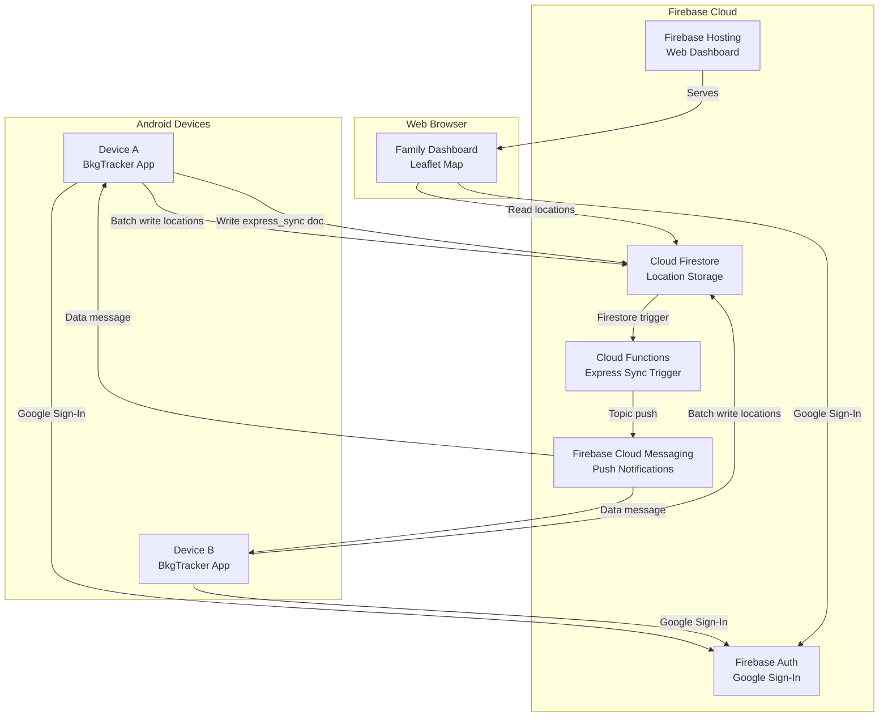
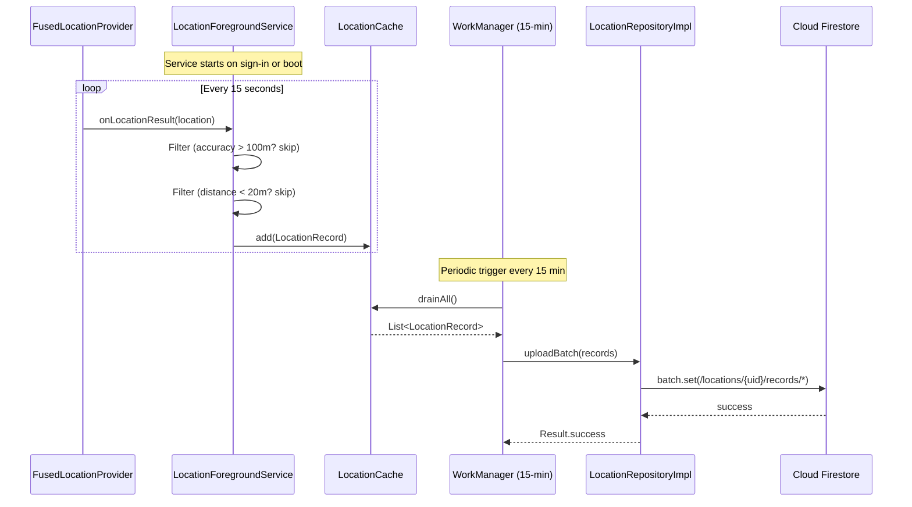
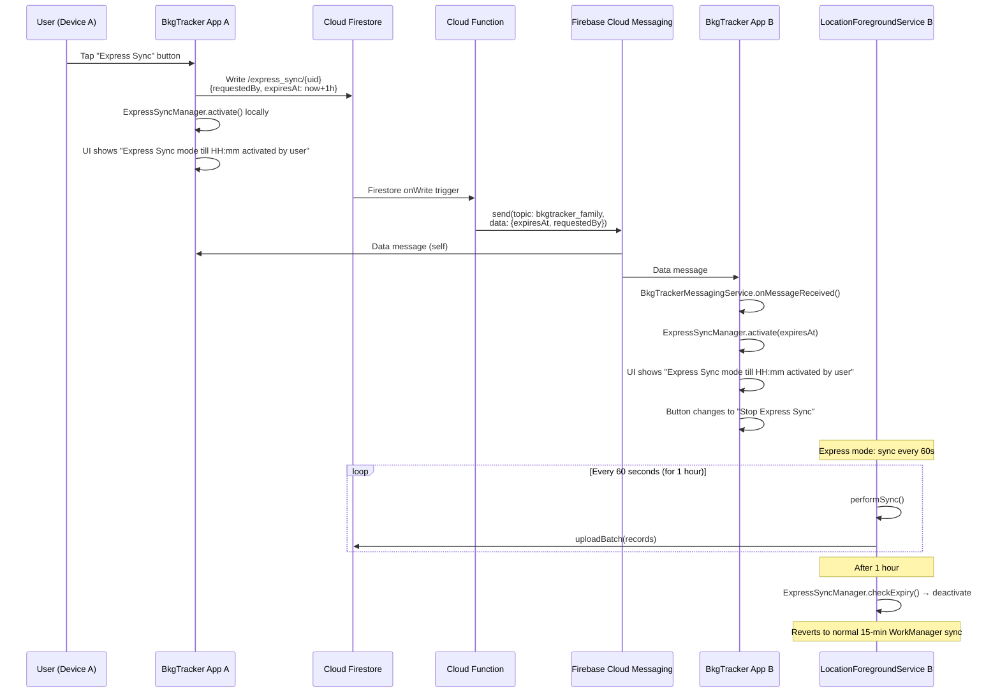
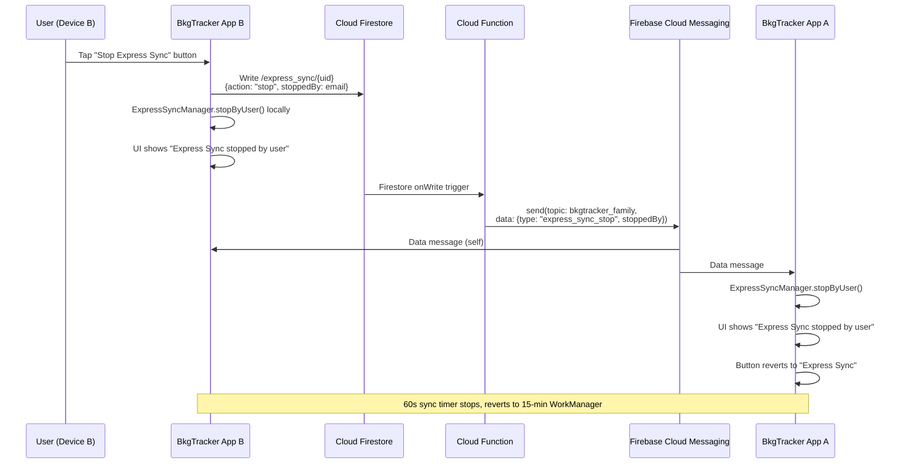
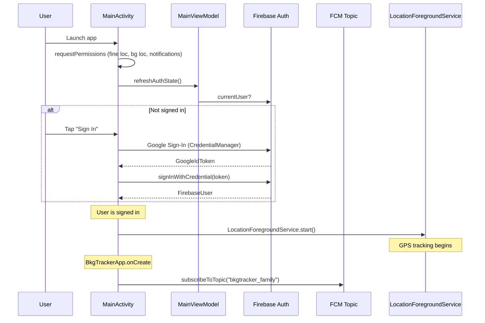
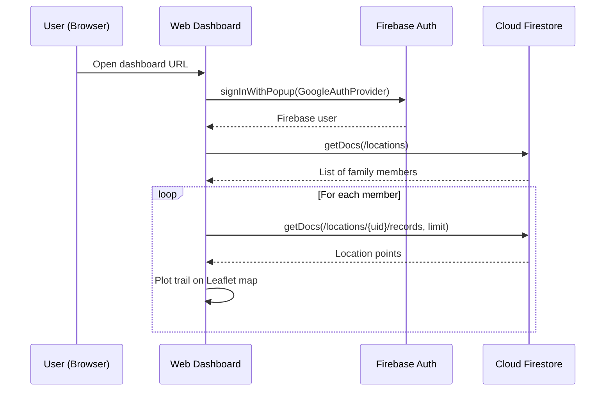
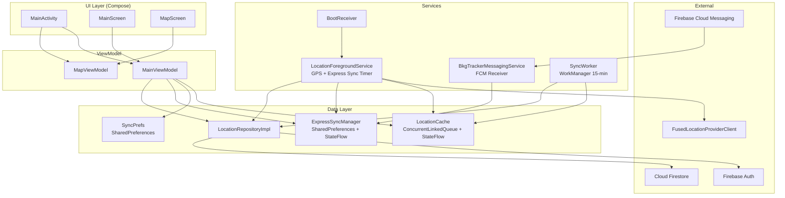
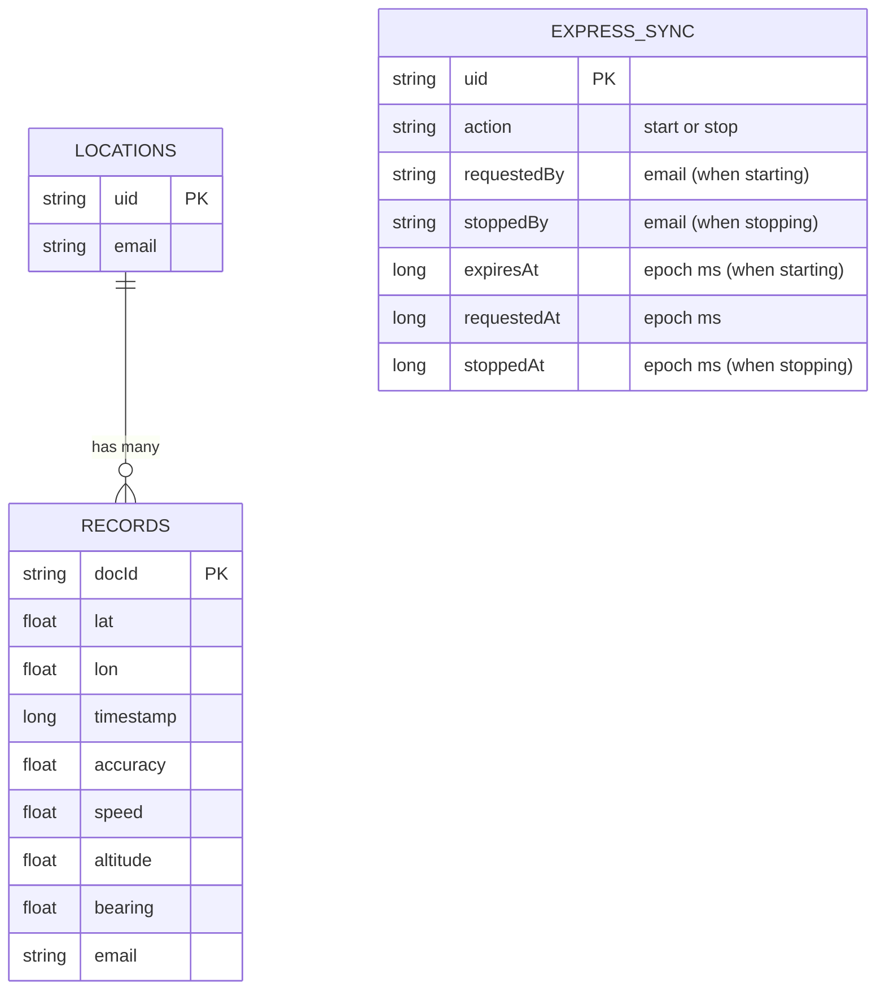

# BkgTracker — Architecture & Design Document

BkgTracker is a family GPS background tracking system consisting of an Android app and a web dashboard, connected via Firebase cloud services.

---

## Deployment Diagram

---

## Firebase Components Used

| Component | Purpose | Firestore Path / Topic |
|-----------|---------|----------------------|
| **Firebase Auth** | Google Sign-In for app + web | — |
| **Cloud Firestore** | Store GPS location records | `/locations/{uid}/records/{docId}` |
| **Cloud Firestore** | Express sync request trigger | `/express_sync/{uid}` |
| **Cloud Functions** | Firestore trigger → FCM broadcast | `onExpressSyncRequested` |
| **Cloud Messaging (FCM)** | Push express sync to all devices | Topic: `bkgtracker_family` |
| **Firebase Hosting** | Serve web dashboard (Leaflet map) | `web/` directory |

---

## Sequence Diagram — Normal Location Tracking & Sync

---

## Sequence Diagram — Express Sync Activation (FCM Broadcast)

---

## Sequence Diagram — Stop Express Sync (FCM Broadcast)

---

## Sequence Diagram — App Startup & Authentication

---

## Sequence Diagram — Web Dashboard

---

## Component Diagram — Android App

---

## Firestore Data Model

---

## Key Design Decisions

- **GPS Fix Interval (Normal)**: 60 seconds (PRIORITY_HIGH_ACCURACY via FusedLocationProviderClient)
- **GPS Fix Interval (Express)**: 10 seconds — filters bypassed for maximum data capture
- **Distance Filter**: Only saves if moved ≥ 20m from last saved point (normal mode only, bypassed in express)
- **Accuracy Filter**: Skips if GPS accuracy > 100m (normal mode only, bypassed in express)
- **Normal Sync**: WorkManager every 15 minutes (requires network)
- **Express Sync**: 60-second timer in ForegroundService, lasts 1 hour, FCM broadcast to all family devices
- **Express Sync Stop**: Any device can stop express sync for all devices via FCM broadcast
- **Express Status**: All devices show "Express Sync mode till {time} activated by {user}" or "Express Sync stopped by {user}"
- **Points (24h)**: Rolling 24-hour counter of saved GPS points, not reset by sync drain
- **Cache**: MutableList in memory + JSON file persistence
- **Auth**: Google Sign-In → Firebase Auth token → Firestore security rules
- **Boot Resilience**: BootReceiver restarts foreground service after reboot if signed in
