# BkgTracker — Architecture & Design Document

BkgTracker is a family GPS background tracking system consisting of an Android app and a web dashboard, connected via Firebase cloud services.

---

## Deployment Diagram

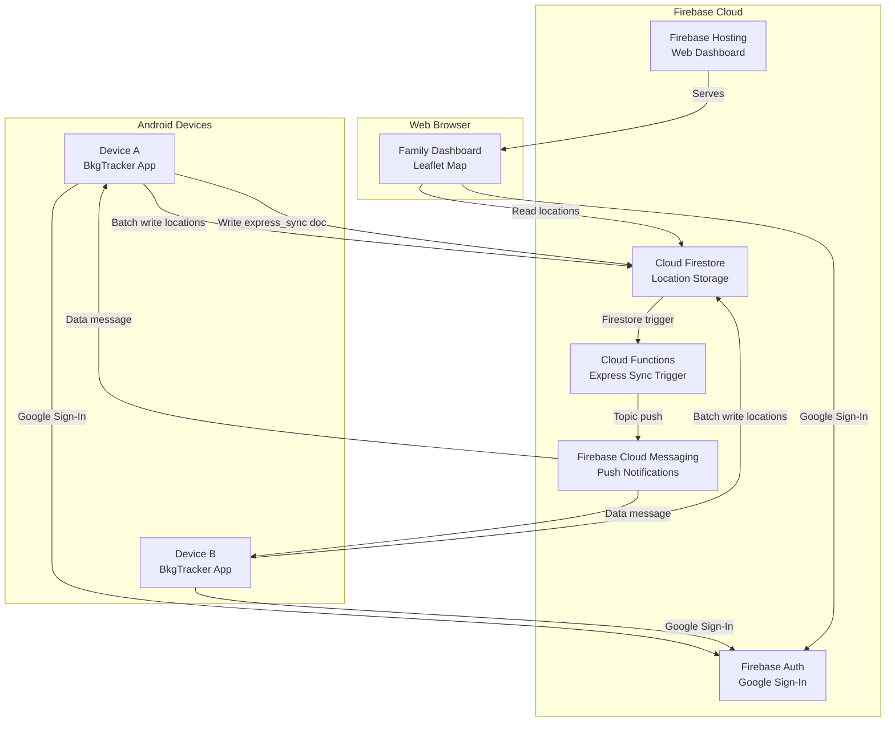

---

## Firebase Components Used

| Component | Purpose | Firestore Path / Topic |
|-----------|---------|----------------------|
| **Firebase Auth** | Google Sign-In for app + web | — |
| **Cloud Firestore** | Store GPS location records | `/locations/{uid}/records/{docId}` |
| **Cloud Firestore** | Express sync request trigger | `/express_sync/{uid}` |
| **Cloud Functions** | Firestore trigger → FCM broadcast | `onExpressSyncRequested` |
| **Cloud Messaging (FCM)** | Push express sync to all devices | Topic: `bkgtracker_family` |
| **Firebase Hosting** | Serve web dashboard (Leaflet map) | `web/` directory |

---

## Sequence Diagram — Normal Location Tracking & Sync

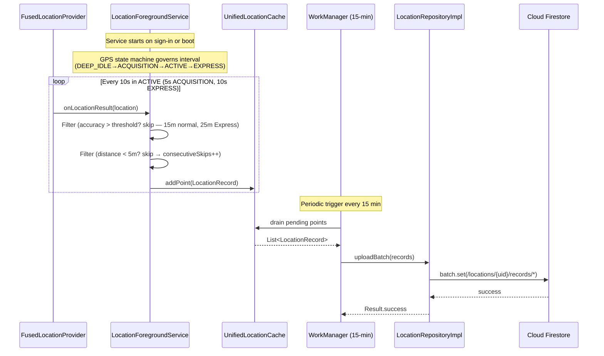

---

## GPS State Machine (Battery-Aware Tracking)

`LocationForegroundService` governs the GPS request interval through a four-state machine to balance
tracking fidelity against battery drain.

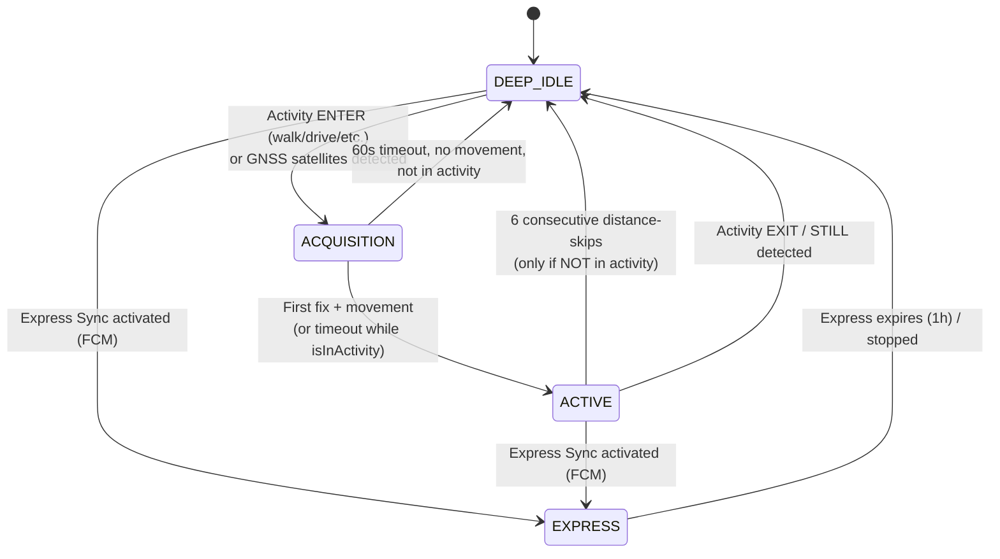

| State | Meaning | Interval |
|-------|---------|---------:|
| `DEEP_IDLE` | GPS off, minimal battery; awaiting activity/satellites | off |
| `ACQUISITION` | Fast startup, seeking first fix | 5s |
| `ACTIVE` | Normal movement tracking | 10s |
| `EXPRESS` | High-frequency, distance filter bypassed; accuracy filter applies at 25m | 10s |

Key constants (in `LocationForegroundService`): `MIN_DISTANCE_METERS = 5`,
`INDOOR_ACCURACY_THRESHOLD = 15m`, `EXPRESS_INDOOR_ACCURACY_THRESHOLD = 25m`,
`ACQUISITION_TIMEOUT_MS = 60s`, `STATIONARY_SKIP_THRESHOLD = 6`.

> **Notification rule**: the foreground notification state is updated ONLY by the `enter*Mode()`
> methods, never from `onLocationAvailability()` (which previously caused stale "GPS active" text).

---

## Sequence Diagram — Activity-Based Wakeup

The Activity Recognition API wakes GPS when movement starts and sleeps it when the user is STILL or
an activity ends. While `isInActivity` is true, the service will NOT drop to DEEP_IDLE even if
stationary — this prevents missed points when movement is minimal/delayed after wake.

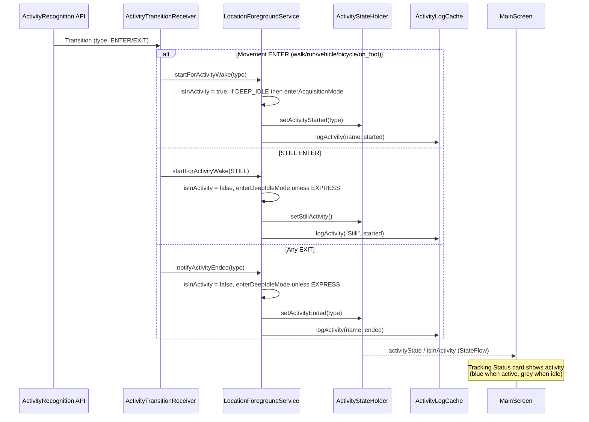

Registered transition types (ENTER + EXIT): `IN_VEHICLE`, `ON_BICYCLE`, `ON_FOOT`, `WALKING`,
`RUNNING`, `STILL`. `ActivityLogCache` retains entries for the last **120 minutes**, viewable via
the top-bar **Activity Log** menu.

---

## Sequence Diagram — Map View with Cache Optimization

`UnifiedLocationCache` minimizes Firestore reads by tracking the time window already fetched per user
and only querying for new points incrementally.

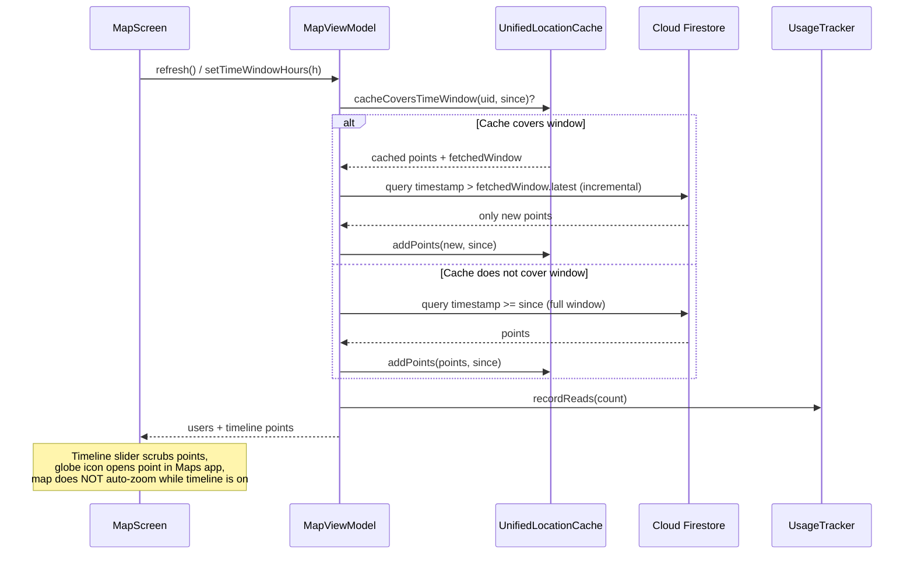

---

## Sequence Diagram — Express Sync Activation (FCM Broadcast)

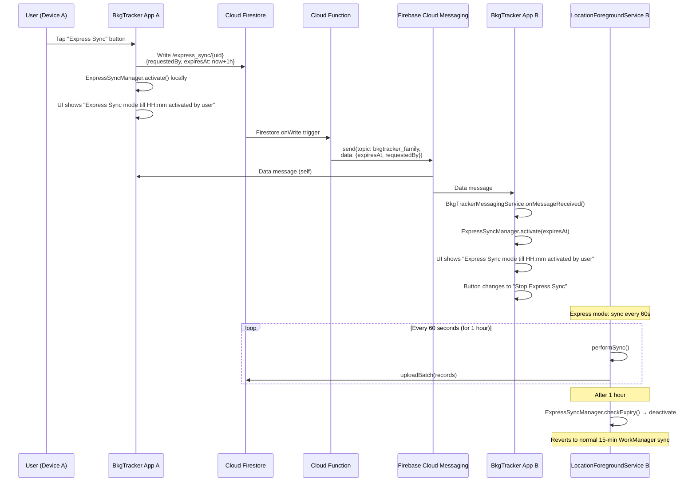

---

## Sequence Diagram — Stop Express Sync (FCM Broadcast)

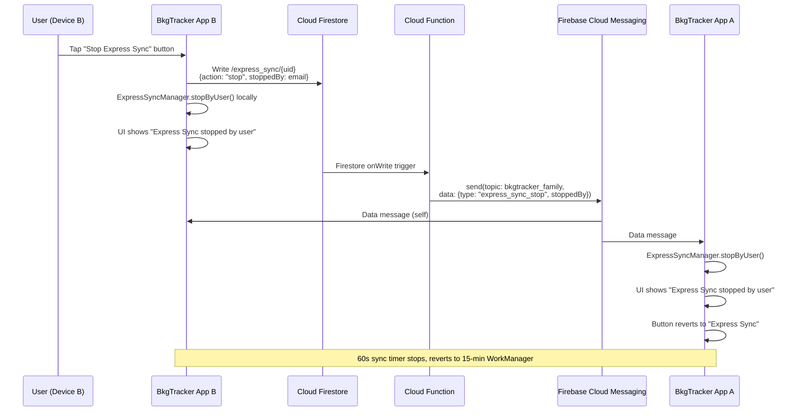

---

## Sequence Diagram — App Startup & Authentication

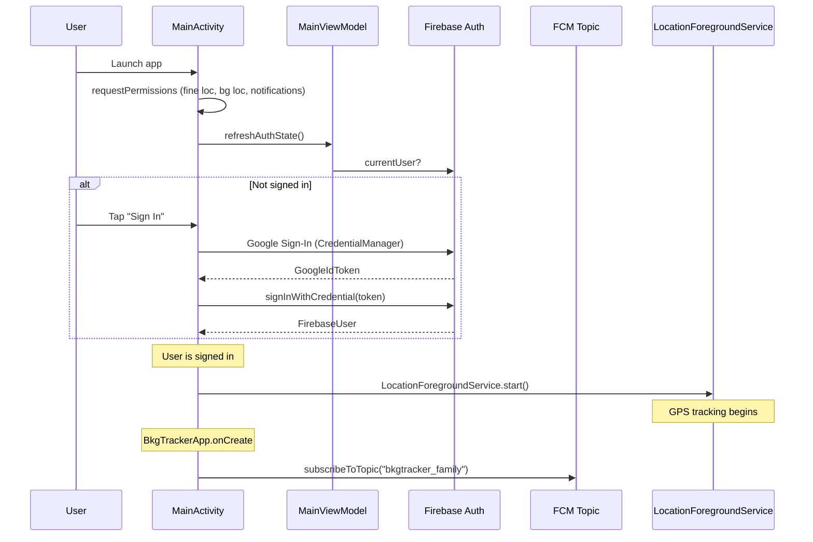

---

## Sequence Diagram — Web Dashboard

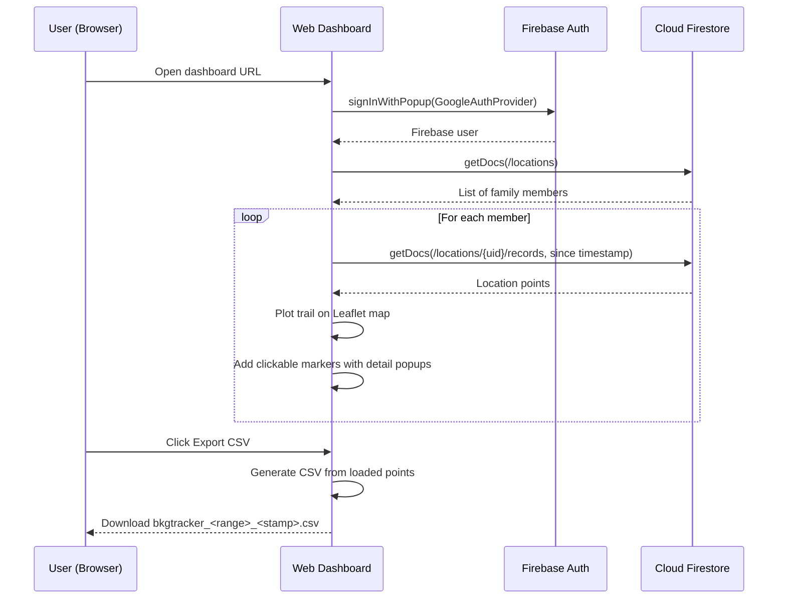

---

## Component Diagram — Android App

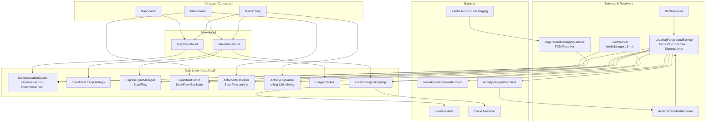

---

## Firestore Data Model

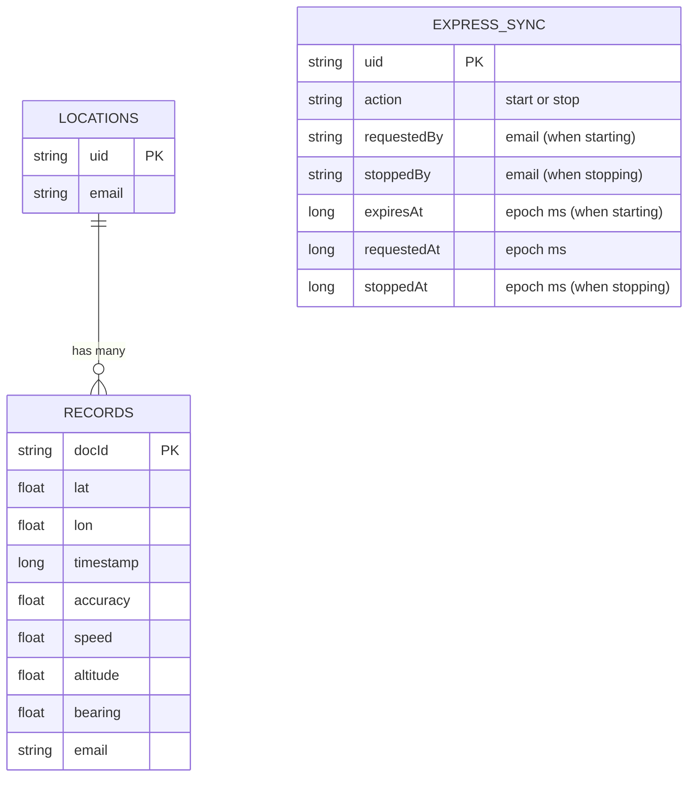

---

## Build Signing

Both debug and release builds use the same signing configuration, defined in `app/build.gradle.kts`:

| Property | Value |
|----------|-------|
| **Keystore** | `%USERPROFILE%\.android\debug.keystore` (Gradle: `System.getProperty("user.home") + "/.android/debug.keystore"`) |
| **Alias** | `androiddebugkey` |
| **Store password** | `android` |
| **Key password** | `android` |

The `signingConfigs` block defines a single `"shared"` config used by both `debug` and `release` build types.

> **Important**: The SHA-1 fingerprint from this keystore must be registered in Firebase Console
> (Project Settings → Your apps → SHA certificate fingerprints) for Google Play Services APIs
> (Activity Recognition, location) to function. Without this, GMS returns `DEVELOPER_ERROR`.

To extract the SHA-1:
```powershell
keytool -list -v -keystore "%USERPROFILE%\.android\debug.keystore" -alias androiddebugkey -storepass android
```

---

## Activity Recognition API Setup

Activity detection is performed entirely on-device by Google Play Services using sensor fusion
(accelerometer, gyroscope, barometer, cell/WiFi signal patterns) and a local ML model. However,
GMS gates API access behind an authorization check, requiring two server-side registrations:

### 1. Firebase Console — SHA-1 Fingerprint
- Go to **Firebase Console → Project Settings → Your apps → Android app (`com.sj.bkgtracker`)**
- Add the SHA-1 fingerprint from the build keystore (see Build Signing above)
- Re-download `google-services.json` and place it in `app/`

### 2. Google Cloud Console — Enable API
- Go to **[Google Cloud Console](https://console.cloud.google.com/) → APIs & Services → Library**
- Select the project linked to Firebase (project ID: `bkgtracker`)
- Search for and enable the **Activity Recognition API** (may appear under Fitness API)

### How It Works
1. **Sensors** (phone hardware) → raw accelerometer, gyro, barometer data
2. **ML Model** (Google Play Services, on-device) → classifies into WALKING, DRIVING, STILL, etc.
3. **API Gateway** (Google Play Services) → validates app identity (SHA-1 + package name) before granting access
4. **Authorization** (Google Cloud/Firebase, server-side) → stores which apps are allowed to use the API

### Key Facts
- **Cost**: Completely free, no quota limits
- **Network**: Works offline after initial credential validation is cached
- **PendingIntent**: Must use `FLAG_MUTABLE` (not `FLAG_IMMUTABLE`) so GMS can attach `ActivityTransitionResult` extras to the broadcast intent

---

## Key Design Decisions

- **GPS State Machine**: DEEP_IDLE (off) → ACQUISITION (5s) → ACTIVE (10s); EXPRESS (10s) overrides all. (PRIORITY_HIGH_ACCURACY via FusedLocationProviderClient)
- **GPS Fix Interval (Active/Normal)**: 10 seconds (`NORMAL_INTERVAL_MS`)
- **GPS Fix Interval (Acquisition)**: 5 seconds for fast first fix after wake; 60s timeout back to idle if no movement
- **GPS Fix Interval (Express)**: 10 seconds — distance filter bypassed; accuracy filter applies at 25m (15m for normal modes)
- **Activity-Based Wakeup**: Activity Recognition transitions wake GPS on movement (walk/run/vehicle/bicycle/on_foot ENTER) and sleep it on STILL/EXIT. `isInActivity` flag keeps GPS awake during ongoing activity even when stationary.
- **Distance Filter**: Only saves if moved ≥ 5m from last saved point (bypassed in express)
- **Accuracy Filter**: Skips if GPS accuracy > 15m in normal modes or > 25m in Express. Cell/WiFi assisted fixes are typically 20–600m, genuine GPS is typically 3–10m.
- **Stationary Detection**: 6 consecutive distance-skips → DEEP_IDLE, but only when NOT in an activity
- **Normal Sync**: WorkManager every 15 minutes (requires network)
- **Express Sync**: 60-second timer in ForegroundService, lasts 1 hour, FCM broadcast to all family devices
- **Express Sync Stop**: Any device can stop express sync for all devices via FCM broadcast
- **Express Status**: All devices show "Express Sync mode till {time} activated by {user}" or "Express Sync stopped by {user}"
- **Read Cache**: `UnifiedLocationCache` caches per-user points and tracks fetched windows so map reads only query Firebase incrementally (new points since last fetch). Write pipeline is independent of read-cache tracking.
- **Usage Tracking**: `UsageTracker` records Firestore reads/writes/FCM, surfaced in the "Usage" dialog.
- **Activity Log**: `ActivityLogCache` keeps activity transitions for the last 120 minutes, shown via the "Activity Log" menu.
- **Map Timeline**: Scrubbable slider over loaded points; selecting a point shows a globe icon that opens it in the phone's Maps app (`geo:` URI). Auto zoom/center is suppressed while the timeline is active so the user keeps manual control.
- **Map Export (KML)**: Share icon in Map toolbar exports one KML 2.2 file per visible user as a `<LineString>` track with Start/End placemarks, shared via `ACTION_SEND_MULTIPLE` using `FileProvider` (`filesDir/exports/`). Compatible with Google Earth mobile/desktop.
- **Map Export (Raw CSV)**: Bug icon in Map toolbar exports a CSV of all cached points with timestamp, lat, lon, accuracy, speed, altitude, bearing — for debugging GPS quality. Both exports are gated by `FileProvider` (`${applicationId}.fileprovider`).
- **Web Dashboard (Clickable Points)**: Each point on the Leaflet trail is rendered as a small clickable marker with a popup showing email, accuracy, speed, altitude, and local timestamp.
- **Web Dashboard (CSV Export)**: Export CSV button downloads the currently visible points as `bkgtracker_<range>_<stamp>.csv` with columns `timestamp_utc,email,lat,lon,accuracy_m,speed_kmh,altitude_m,bearing_deg`.
- **Web Dashboard (Client Cache)**: The dashboard keeps fetched points in memory per user. On Refresh it fetches only points newer than the last fetch time (`lastFetchMs`) for the same or narrowed time window. If the time window is widened, the cache is discarded and a full fetch for that window runs. The Firestore query is bounded only by the selected time window, so the cache is always complete for that window. The status line shows how many points were fetched in the current refresh so the cache behaviour is visible.
- **Auth**: Google Sign-In → Firebase Auth token → Firestore security rules
- **Boot Resilience**: BootReceiver restarts foreground service after reboot if signed in
- **File Persistence**: JSON saves use `ContentResolver` mode `"wt"` (write+truncate) to avoid stale trailing bytes on Android 10+

---

## Firebase Free Tier (Spark Plan) Usage Estimate

Assumptions: **4 devices**, **~4 hours express mode/day**, **~10 start/stop button clicks/day**, **~20 hours normal mode/day**.

### Firestore Writes (Free limit: 20K/day)

| Operation | Calculation | Daily Writes |
|---|---|---:|
| Normal mode GPS saves | 4 devices × 20h × 60 fixes/hr × ~30% pass filter | ~1,440 |
| Express mode GPS saves | 4 devices × 4h × 360 fixes/hr (10s, no filter) | ~5,760 |
| Express sync uploads | 4 devices × 4h × 60 syncs/hr (batch writes) | ~5,760 |
| Normal sync uploads | 4 devices × 20h ÷ 0.25h × ~4.5 records | ~1,440 |
| Express start/stop docs | 10 clicks × 1 write | 10 |
| **Total** | | **~14,410** |

**~72% of free limit — safe with headroom** |

### Firestore Reads (Free limit: 50K/day)

| Operation | Calculation | Daily Reads |
|---|---|---:|
| Web dashboard | ~4 users × few refreshes × ~100 docs | ~400 |
| Cloud Function triggers | ~10 reads | 10 |
| **Total** | | **~410** |

**< 1% of free limit** |

### Cloud Functions (Free limit: 125K invocations/month, 40K GB-seconds/month)

| Metric | Calculation | Monthly |
|---|---|---:|
| Invocations | 10/day × 30 days | 300 |
| Compute | ~100ms × 256MB per invocation | ~0.75 GB-s |

**< 1% of free limits** |

### Firebase Cloud Messaging

**Completely free** — no limits on data messages. ~10 topic messages/day = no cost.

### Summary

| Service | Daily Usage | Free Limit | Utilisation |
|---|---|---|---:|
| Firestore writes | ~14.4K | 20K | ~72% |
| Firestore reads | ~410 | 50K | < 1% |
| Cloud Functions | ~10/day | ~4.1K/day | < 1% |
| FCM | 10 msgs | Unlimited | 0% |

> **Verdict**: Comfortably within free tier. The tightest constraint is Firestore writes at ~72%.
> Adding more devices or increasing express usage could approach the limit — at that point
> consider upgrading to Blaze pay-as-you-go ($0.18 per 100K writes).
