# OBD2App — Architecture, Design Patterns & Screen Guide

## Table of Contents

1. [Project Structure](#project-structure)
2. [Design Patterns](#design-patterns)
3. [App Lifecycle](#app-lifecycle)
4. [Screen Navigation](#screen-navigation)
5. [Screen-by-Screen Breakdown](#screen-by-screen-breakdown)
6. [Data Flow Architecture](#data-flow-architecture)
7. [Trip Lifecycle](#trip-lifecycle)
8. [OBD Connection Management](#obd-connection-management)

---

## Project Structure

```
com.sj.obd2app/
├── MainActivity.kt              # Single Activity host
├── MainPagerAdapter.kt          # ViewPager2 adapter (7 pages)
├── DashboardsHostFragment.kt    # Nested NavHost for dashboards
├── bluetooth/
│   └── BluetoothBondLossReceiver.kt
├── gps/
│   ├── GpsDataSource.kt         # Singleton GPS provider
│   ├── GpsDataItem.kt           # GPS data model
│   └── GeoidCorrection.kt
├── metrics/
│   ├── MetricsCalculator.kt     # Central calculation engine (singleton)
│   ├── MetricsLogger.kt         # JSON trip logger
│   ├── VehicleMetrics.kt        # Immutable metrics snapshot
│   ├── TripState.kt             # Mutable trip accumulators
│   ├── TripPhase.kt             # IDLE / RUNNING / PAUSED enum
│   ├── AccelEngine.kt           # Accelerometer math
│   ├── AccelCalibration.kt
│   ├── AccelMetrics.kt
│   ├── PowerCalculations.kt
│   ├── calculator/
│   │   ├── FuelCalculator.kt    # Fuel consumption strategies
│   │   ├── PowerCalculator.kt   # Power from accel/thermo/OBD
│   │   └── TripCalculator.kt    # Distance, speed, drive modes
│   └── collector/
│       └── DataOrchestrator.kt  # Combines OBD + GPS flows
├── obd/
│   ├── Obd2Service.kt           # Interface (Strategy pattern)
│   ├── BluetoothObd2Service.kt  # Real BT implementation
│   ├── MockObd2Service.kt       # Mock implementation
│   ├── Obd2ServiceProvider.kt   # Factory / provider
│   ├── ObdStateManager.kt       # Centralized state (object singleton)
│   ├── ObdConnectionManager.kt  # Auto-reconnect during trips
│   ├── Elm327Transport.kt       # Transport interface
│   ├── ClassicBluetoothTransport.kt
│   ├── BleTransport.kt
│   ├── Obd2Command.kt           # Command model
│   ├── Obd2CommandRegistry.kt   # Known PID definitions
│   ├── Obd2DataItem.kt          # Parsed PID result
│   ├── PidDiscoveryService.kt   # Brute-force PID scanner
│   ├── PidFormulaParser.kt      # Custom PID formula evaluator
│   ├── CustomPid.kt             # Custom PID model
│   └── Mock*.kt                 # Mock data infrastructure
├── sensors/
│   └── AccelerometerSource.kt   # Singleton sensor wrapper
├── service/
│   └── TripForegroundService.kt # Foreground service for trips
├── settings/
│   ├── AppSettings.kt           # Global settings (object singleton)
│   ├── VehicleProfile.kt        # Profile data model
│   ├── VehicleProfileRepository.kt  # CRUD repository (singleton)
│   ├── VehicleProfileEditSheet.kt   # BottomSheet editor
│   ├── CustomPidEditSheet.kt
│   ├── CustomPidListSheet.kt
│   ├── CustomPidDiff.kt
│   └── PidCache.kt
├── storage/
│   ├── AppDataDirectory.kt      # SAF / internal file management
│   └── DataMigration.kt
└── ui/
    ├── TopBarHelper.kt          # Overflow menu helper
    ├── connect/
    │   ├── ConnectFragment.kt
    │   └── ConnectViewModel.kt
    ├── dashboard/
    │   ├── data/LayoutRepository.kt
    │   ├── model/
    │   ├── views/               # Custom gauge views
    │   └── wizard/
    ├── details/
    │   ├── DetailsFragment.kt
    │   └── DetailsViewModel.kt
    ├── mapview/
    │   └── MapViewFragment.kt
    ├── settings/
    │   ├── SettingsFragment.kt
    │   └── PidDiscoverySheet.kt
    ├── trip/
    │   ├── TripFragment.kt
    │   └── TripViewModel.kt
    └── tripsummary/
        └── TripSummaryFragment.kt
```

---

## Design Patterns

### 1. Singleton (Thread-Safe Double-Check Locking)

Used extensively for long-lived service objects that need a single instance across the app.


```mermaid
classDiagram
    class MetricsCalculator {
        -INSTANCE: MetricsCalculator?
        +getInstance(context): MetricsCalculator
    }
    class BluetoothObd2Service {
        -instance: BluetoothObd2Service?
        +getInstance(context?): BluetoothObd2Service
    }
    class VehicleProfileRepository {
        -INSTANCE: VehicleProfileRepository?
        +getInstance(context): VehicleProfileRepository
    }
    class GpsDataSource {
        -INSTANCE: GpsDataSource?
        +getInstance(context): GpsDataSource
    }
    class ObdConnectionManager {
        -instance: ObdConnectionManager?
        +getInstance(context): ObdConnectionManager
    }
    class PidDiscoveryService {
        -instance: PidDiscoveryService?
        +getInstance(): PidDiscoveryService
    }
    class AccelerometerSource {
        -INSTANCE: AccelerometerSource?
        +getInstance(context): AccelerometerSource
    }
```

**Implementation pattern** (all use the same idiom):
```kotlin
companion object {
    @Volatile private var INSTANCE: T? = null
    fun getInstance(context: Context): T =
        INSTANCE ?: synchronized(this) {
            INSTANCE ?: T(context.applicationContext).also { INSTANCE = it }
        }
}
```

**Also uses Kotlin `object` singletons** for stateless managers:
- `AppSettings` — global settings access
- `ObdStateManager` — centralized OBD mode/connection state
- `Obd2ServiceProvider` — service factory

---

### 2. Observer Pattern (Kotlin StateFlow)

All reactive data flows use `StateFlow` / `MutableStateFlow`. UI fragments collect flows in `lifecycleScope` to automatically handle lifecycle.

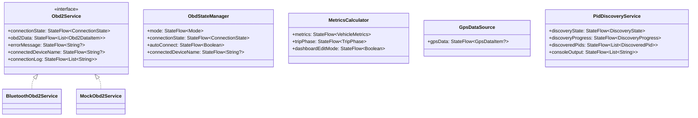
```mermaid
classDiagram
    class Obd2Service {
        <<interface>>
        +connectionState: StateFlow~ConnectionState~
        +obd2Data: StateFlow~List~Obd2DataItem~~
        +errorMessage: StateFlow~String?~
        +connectedDeviceName: StateFlow~String?~
        +connectionLog: StateFlow~List~String~~
    }
    class ObdStateManager {
        +mode: StateFlow~Mode~
        +connectionState: StateFlow~ConnectionState~
        +autoConnect: StateFlow~Boolean~
        +connectedDeviceName: StateFlow~String?~
    }
    class MetricsCalculator {
        +metrics: StateFlow~VehicleMetrics~
        +tripPhase: StateFlow~TripPhase~
        +dashboardEditMode: StateFlow~Boolean~
    }
    class GpsDataSource {
        +gpsData: StateFlow~GpsDataItem?~
    }
    class PidDiscoveryService {
        +discoveryState: StateFlow~DiscoveryState~
        +discoveryProgress: StateFlow~DiscoveryProgress~
        +discoveredPids: StateFlow~List~DiscoveredPid~~
        +consoleOutput: StateFlow~List~String~~
    }

    Obd2Service <|.. BluetoothObd2Service
    Obd2Service <|.. MockObd2Service
```

**Collection pattern in fragments:**
```kotlin
viewLifecycleOwner.lifecycleScope.launch {
    viewModel.someStateFlow.collect { state ->
        updateUI(state)
    }
}
```

---

### 3. Strategy Pattern (OBD2 Service)

The `Obd2Service` interface defines the contract. Two implementations are swapped at runtime:

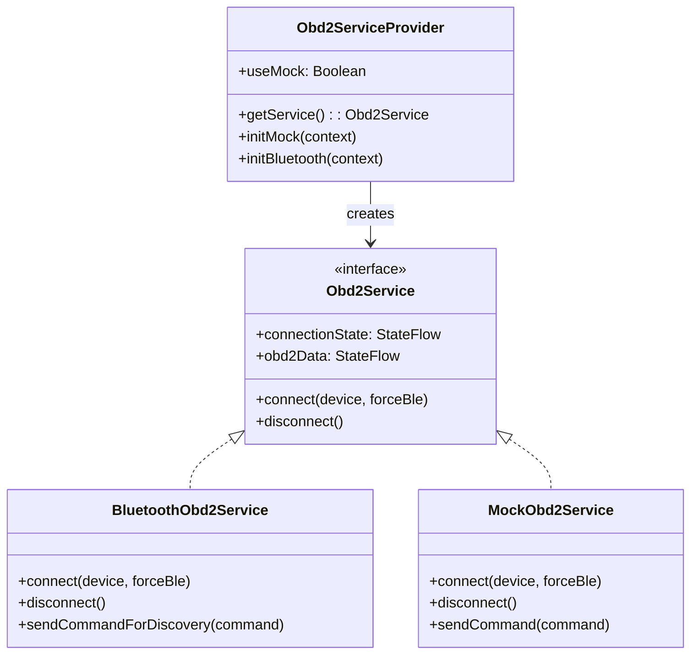
```mermaid
classDiagram
    class Obd2Service {
        <<interface>>
        +connect(device, forceBle)
        +disconnect()
        +connectionState: StateFlow
        +obd2Data: StateFlow
    }
    class BluetoothObd2Service {
        +connect(device, forceBle)
        +disconnect()
        +sendCommandForDiscovery(command)
    }
    class MockObd2Service {
        +connect(device, forceBle)
        +disconnect()
        +sendCommand(command)
    }
    class Obd2ServiceProvider {
        +useMock: Boolean
        +getService(): Obd2Service
        +initMock(context)
        +initBluetooth(context)
    }

    Obd2Service <|.. BluetoothObd2Service
    Obd2Service <|.. MockObd2Service
    Obd2ServiceProvider --> Obd2Service : creates
```

Similarly, `Elm327Transport` is a strategy for the physical transport layer:

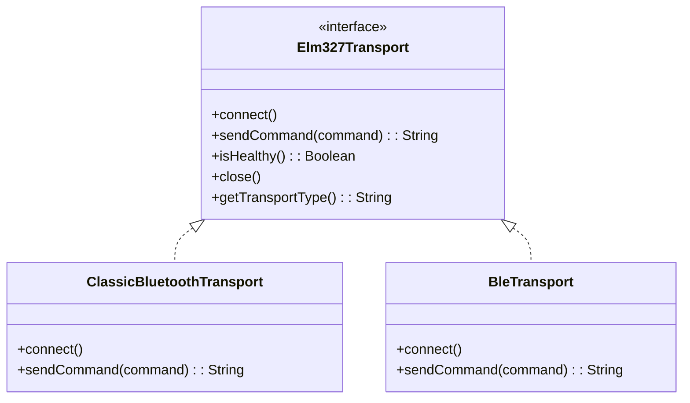
```mermaid
classDiagram
    class Elm327Transport {
        <<interface>>
        +connect()
        +sendCommand(command): String
        +isHealthy(): Boolean
        +close()
        +getTransportType(): String
    }
    class ClassicBluetoothTransport {
        +connect()
        +sendCommand(command): String
    }
    class BleTransport {
        +connect()
        +sendCommand(command): String
    }
    Elm327Transport <|.. ClassicBluetoothTransport
    Elm327Transport <|.. BleTransport
```

---

### 4. Repository Pattern

Data persistence is abstracted behind repository classes:

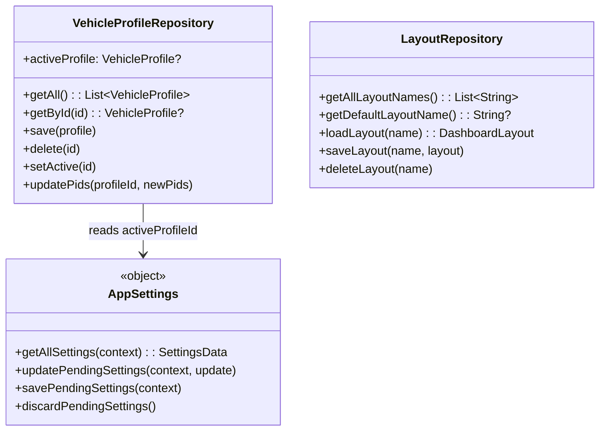
```mermaid
classDiagram
    class VehicleProfileRepository {
        +getAll(): List~VehicleProfile~
        +getById(id): VehicleProfile?
        +save(profile)
        +delete(id)
        +setActive(id)
        +updatePids(profileId, newPids)
        +activeProfile: VehicleProfile?
    }
    class LayoutRepository {
        +getAllLayoutNames(): List~String~
        +getDefaultLayoutName(): String?
        +loadLayout(name): DashboardLayout
        +saveLayout(name, layout)
        +deleteLayout(name)
    }
    class AppSettings {
        <<object>>
        +getAllSettings(context): SettingsData
        +updatePendingSettings(context, update)
        +savePendingSettings(context)
        +discardPendingSettings()
    }

    VehicleProfileRepository --> AppSettings : reads activeProfileId
```

**Storage strategy:** Internal files (JSON) for profiles and layouts. SharedPreferences for settings. SAF (Storage Access Framework) for trip log output folder.

---

### 5. MVVM (Model-View-ViewModel)

Screens use Android `ViewModel` + `LiveData`/`StateFlow` for UI state:

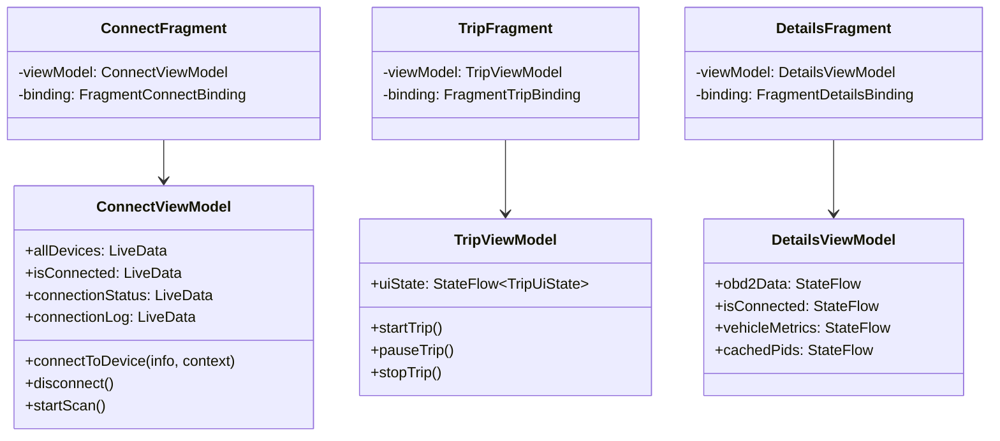
```mermaid
classDiagram
    class ConnectFragment {
        -viewModel: ConnectViewModel
        -binding: FragmentConnectBinding
    }
    class ConnectViewModel {
        +allDevices: LiveData
        +isConnected: LiveData
        +connectionStatus: LiveData
        +connectionLog: LiveData
        +connectToDevice(info, context)
        +disconnect()
        +startScan()
    }
    class TripFragment {
        -viewModel: TripViewModel
        -binding: FragmentTripBinding
    }
    class TripViewModel {
        +uiState: StateFlow~TripUiState~
        +startTrip()
        +pauseTrip()
        +stopTrip()
    }
    class DetailsFragment {
        -viewModel: DetailsViewModel
        -binding: FragmentDetailsBinding
    }
    class DetailsViewModel {
        +obd2Data: StateFlow
        +isConnected: StateFlow
        +vehicleMetrics: StateFlow
        +cachedPids: StateFlow
    }

    ConnectFragment --> ConnectViewModel
    TripFragment --> TripViewModel
    DetailsFragment --> DetailsViewModel
```

---

### 6. Adapter Pattern (ViewPager2 + RecyclerView)

- `MainPagerAdapter` — `FragmentStateAdapter` maps page indices to Fragment classes
- `SectionedDeviceAdapter` — groups BT devices into Paired/Discovered sections
- `ProfileAdapter` — vehicle profile list in Settings
- `Obd2Adapter` — PID value table in Details

---

### 7. Mediator / Orchestrator

`DataOrchestrator` combines multiple data flows into a single calculation pipeline:

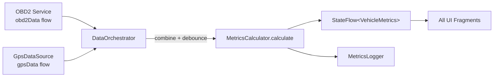
```mermaid
flowchart LR
    OBD[OBD2 Service<br/>obd2Data flow] --> DO[DataOrchestrator]
    GPS[GpsDataSource<br/>gpsData flow] --> DO
    DO -->|combine + debounce| MC[MetricsCalculator.calculate]
    MC --> Metrics[StateFlow&lt;VehicleMetrics&gt;]
    MC --> Logger[MetricsLogger]
    Metrics --> UI[All UI Fragments]
```

---

### 8. Template Method

`BluetoothObd2Service.connect()` follows a fixed sequence — create transport, init ELM327, discover PIDs, lock protocol, start polling. Subclasses (`ClassicBluetoothTransport`, `BleTransport`) only override the transport-specific parts.

---

### 9. State Machine (Trip Phase)

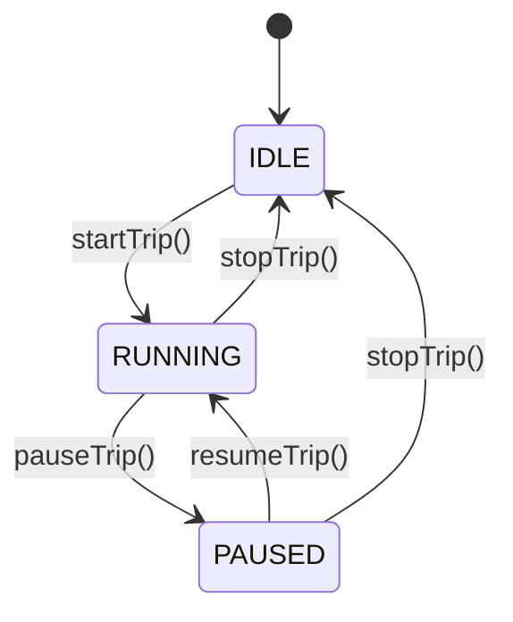
```mermaid
stateDiagram-v2
    [*] --> IDLE
    IDLE --> RUNNING : startTrip()
    RUNNING --> PAUSED : pauseTrip()
    PAUSED --> RUNNING : resumeTrip()
    RUNNING --> IDLE : stopTrip()
    PAUSED --> IDLE : stopTrip()
```

---

### Summary of All Patterns

| Pattern | Where Used | Key Classes |
|---------|-----------|-------------|
| **Singleton** | Service objects, data sources | `MetricsCalculator`, `BluetoothObd2Service`, `GpsDataSource`, `VehicleProfileRepository`, `AccelerometerSource`, `ObdConnectionManager`, `PidDiscoveryService` |
| **Object Singleton** | Stateless managers | `AppSettings`, `ObdStateManager`, `Obd2ServiceProvider` |
| **Observer** | All reactive data | `StateFlow`, `LiveData`, `combine`, `collect` |
| **Strategy** | OBD service, transport | `Obd2Service` ↔ `BluetoothObd2Service` / `MockObd2Service`, `Elm327Transport` ↔ `ClassicBluetoothTransport` / `BleTransport` |
| **Repository** | Data persistence | `VehicleProfileRepository`, `LayoutRepository`, `AppSettings` |
| **MVVM** | UI screens | `ConnectFragment`/`ConnectViewModel`, `TripFragment`/`TripViewModel`, `DetailsFragment`/`DetailsViewModel` |
| **Adapter** | List display | `MainPagerAdapter`, `SectionedDeviceAdapter`, `ProfileAdapter`, `Obd2Adapter` |
| **Mediator** | Data pipeline | `DataOrchestrator` |
| **State Machine** | Trip lifecycle | `TripPhase` enum + `MetricsCalculator` |
| **Factory** | Service creation | `Obd2ServiceProvider.getService()` |
| **Template Method** | Connection flow | `BluetoothObd2Service.connect()` |

---

## App Lifecycle

### Startup Sequence

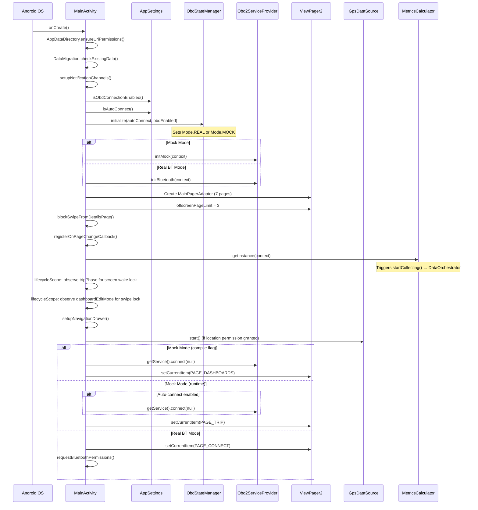
```mermaid
sequenceDiagram
    participant Android as Android OS
    participant MA as MainActivity
    participant Settings as AppSettings
    participant OSM as ObdStateManager
    participant Provider as Obd2ServiceProvider
    participant VP as ViewPager2
    participant GPS as GpsDataSource
    participant MC as MetricsCalculator

    Android->>MA: onCreate()
    MA->>MA: AppDataDirectory.ensureUriPermissions()
    MA->>MA: DataMigration.checkExistingData()
    MA->>MA: setupNotificationChannels()

    MA->>Settings: isObdConnectionEnabled()
    MA->>Settings: isAutoConnect()
    MA->>OSM: initialize(autoConnect, obdEnabled)
    Note over OSM: Sets Mode.REAL or Mode.MOCK

    alt Mock Mode
        MA->>Provider: initMock(context)
    else Real BT Mode
        MA->>Provider: initBluetooth(context)
    end

    MA->>VP: Create MainPagerAdapter (7 pages)
    MA->>VP: offscreenPageLimit = 3
    MA->>MA: blockSwipeFromDetailsPage()
    MA->>MA: registerOnPageChangeCallback()

    MA->>MC: getInstance(context)
    Note over MC: Triggers startCollecting() → DataOrchestrator

    MA->>MA: lifecycleScope: observe tripPhase for screen wake lock
    MA->>MA: lifecycleScope: observe dashboardEditMode for swipe lock

    MA->>MA: setupNavigationDrawer()

    MA->>GPS: start() (if location permission granted)

    alt Mock Mode (compile flag)
        MA->>Provider: getService().connect(null)
        MA->>VP: setCurrentItem(PAGE_DASHBOARDS)
    else Mock Mode (runtime)
        alt Auto-connect enabled
            MA->>Provider: getService().connect(null)
        end
        MA->>VP: setCurrentItem(PAGE_TRIP)
    else Real BT Mode
        MA->>VP: setCurrentItem(PAGE_CONNECT)
        MA->>MA: requestBluetoothPermissions()
    end
```

### Foreground / Background Transitions

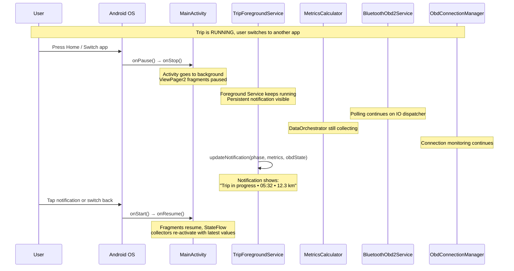
```mermaid
sequenceDiagram
    participant User
    participant Android as Android OS
    participant MA as MainActivity
    participant FGS as TripForegroundService
    participant MC as MetricsCalculator
    participant BT as BluetoothObd2Service
    participant OCM as ObdConnectionManager

    Note over User,OCM: Trip is RUNNING, user switches to another app

    User->>Android: Press Home / Switch app
    Android->>MA: onPause() → onStop()
    Note over MA: Activity goes to background<br/>ViewPager2 fragments paused

    Note over FGS: Foreground Service keeps running<br/>Persistent notification visible
    Note over BT: Polling continues on IO dispatcher
    Note over MC: DataOrchestrator still collecting
    Note over OCM: Connection monitoring continues

    FGS->>FGS: updateNotification(phase, metrics, obdState)
    Note over FGS: Notification shows:<br/>"Trip in progress • 05:32 • 12.3 km"

    User->>Android: Tap notification or switch back
    Android->>MA: onStart() → onResume()
    Note over MA: Fragments resume, StateFlow<br/>collectors re-activate with latest values
```

### Foreground Service Lifecycle

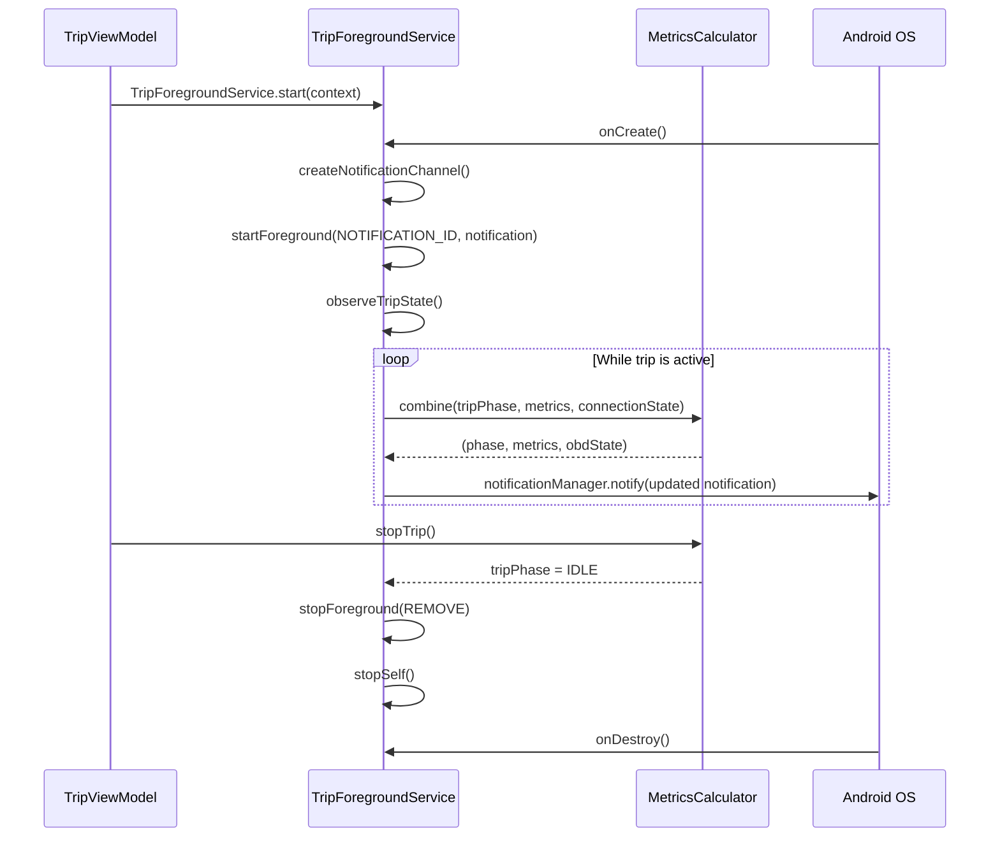
```mermaid
sequenceDiagram
    participant Trip as TripViewModel
    participant FGS as TripForegroundService
    participant MC as MetricsCalculator
    participant Android as Android OS

    Trip->>FGS: TripForegroundService.start(context)
    Android->>FGS: onCreate()
    FGS->>FGS: createNotificationChannel()
    FGS->>FGS: startForeground(NOTIFICATION_ID, notification)
    FGS->>FGS: observeTripState()

    loop While trip is active
        FGS->>MC: combine(tripPhase, metrics, connectionState)
        MC-->>FGS: (phase, metrics, obdState)
        FGS->>Android: notificationManager.notify(updated notification)
    end

    Trip->>MC: stopTrip()
    MC-->>FGS: tripPhase = IDLE
    FGS->>FGS: stopForeground(REMOVE)
    FGS->>FGS: stopSelf()
    Android->>FGS: onDestroy()
```

### Screen Wake Lock

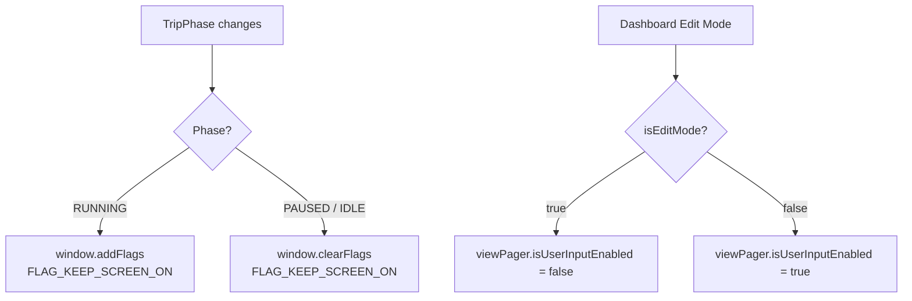
```mermaid
flowchart TD
    A[TripPhase changes] --> B{Phase?}
    B -->|RUNNING| C[window.addFlags<br/>FLAG_KEEP_SCREEN_ON]
    B -->|PAUSED / IDLE| D[window.clearFlags<br/>FLAG_KEEP_SCREEN_ON]

    E[Dashboard Edit Mode] --> F{isEditMode?}
    F -->|true| G[viewPager.isUserInputEnabled = false]
    F -->|false| H[viewPager.isUserInputEnabled = true]
```

---

## Screen Navigation

### ViewPager2 Page Layout

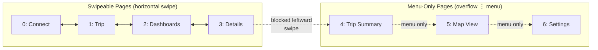
```mermaid
flowchart LR
    subgraph Swipeable["Swipeable Pages (horizontal swipe)"]
        P0[0: Connect]
        P1[1: Trip]
        P2[2: Dashboards]
        P3[3: Details]
    end

    subgraph MenuOnly["Menu-Only Pages (overflow ⋮ menu)"]
        P4[4: Trip Summary]
        P5[5: Map View]
        P6[6: Settings]
    end

    P0 <--> P1 <--> P2 <--> P3
    P3 -.->|blocked leftward<br/>swipe| P4
    P4 -.->|menu only| P5
    P5 -.->|menu only| P6
```

### Navigation Rules

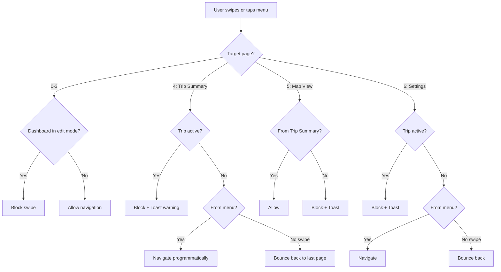
```mermaid
flowchart TD
    A[User swipes or taps menu] --> B{Target page?}
    B -->|0-3| C{Dashboard in edit mode?}
    C -->|Yes| D[Block swipe]
    C -->|No| E[Allow navigation]

    B -->|4: Trip Summary| F{Trip active?}
    F -->|Yes| G[Block + Toast warning]
    F -->|No| H{From menu?}
    H -->|Yes| I[Navigate programmatically]
    H -->|No swipe| J[Bounce back to last page]

    B -->|5: Map View| K{From Trip Summary?}
    K -->|Yes| L[Allow]
    K -->|No| M[Block + Toast]

    B -->|6: Settings| N{Trip active?}
    N -->|Yes| O[Block + Toast]
    N -->|No| P{From menu?}
    P -->|Yes| Q[Navigate]
    P -->|No swipe| R[Bounce back]
```

### Details Page Swipe Blocking

The Details page (index 3) blocks **leftward swipe** to prevent accidental navigation to Trip Summary:

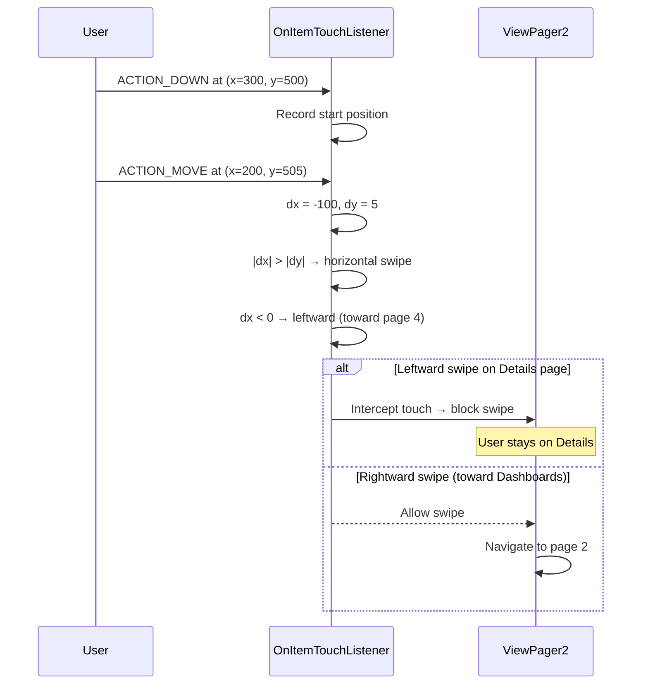
```mermaid
sequenceDiagram
    participant User
    participant Touch as OnItemTouchListener
    participant VP as ViewPager2

    User->>Touch: ACTION_DOWN at (x=300, y=500)
    Touch->>Touch: Record start position

    User->>Touch: ACTION_MOVE at (x=200, y=505)
    Touch->>Touch: dx = -100, dy = 5
    Touch->>Touch: |dx| > |dy| → horizontal swipe
    Touch->>Touch: dx < 0 → leftward (toward page 4)

    alt Leftward swipe on Details page
        Touch->>VP: Intercept touch → block swipe
        Note over VP: User stays on Details
    else Rightward swipe (toward Dashboards)
        Touch-->>VP: Allow swipe
        VP->>VP: Navigate to page 2
    end
```

---

## Screen-by-Screen Breakdown

### Page 0: Connect Screen

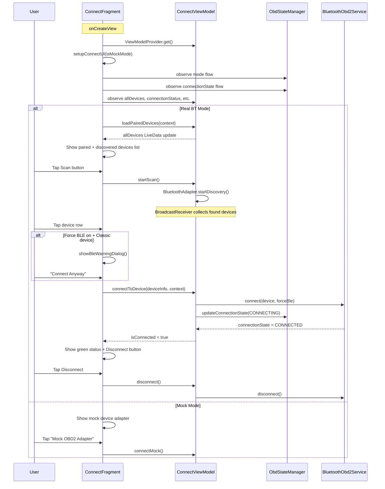
```mermaid
sequenceDiagram
    participant User
    participant CF as ConnectFragment
    participant VM as ConnectViewModel
    participant OSM as ObdStateManager
    participant BT as BluetoothObd2Service

    Note over CF: onCreateView
    CF->>VM: ViewModelProvider.get()
    CF->>CF: setupConnectUI(isMockMode)

    CF->>OSM: observe mode flow
    CF->>OSM: observe connectionState flow
    CF->>VM: observe allDevices, connectionStatus, etc.

    alt Real BT Mode
        CF->>VM: loadPairedDevices(context)
        VM-->>CF: allDevices LiveData update
        CF->>CF: Show paired + discovered devices list

        User->>CF: Tap Scan button
        CF->>VM: startScan()
        VM->>VM: BluetoothAdapter.startDiscovery()
        Note over VM: BroadcastReceiver collects found devices

        User->>CF: Tap device row
        alt Force BLE on + Classic device
            CF->>CF: showBleWarningDialog()
            User->>CF: "Connect Anyway"
        end
        CF->>VM: connectToDevice(deviceInfo, context)
        VM->>BT: connect(device, forceBle)
        VM->>OSM: updateConnectionState(CONNECTING)

        BT-->>VM: connectionState = CONNECTED
        VM-->>CF: isConnected = true
        CF->>CF: Show green status + Disconnect button

        User->>CF: Tap Disconnect
        CF->>VM: disconnect()
        VM->>BT: disconnect()

    else Mock Mode
        CF->>CF: Show mock device adapter
        User->>CF: Tap "Mock OBD2 Adapter"
        CF->>VM: connectMock()
    end
```

**Interactions:**
- **Tap device row** → Connect to Bluetooth device
- **Tap Scan icon** → Start BT discovery
- **Tap Disconnect** → Disconnect from adapter
- **Force BLE toggle** → Switch between Classic/BLE transport
- **BLE Info icon** → Show info dialog
- **Overflow menu (⋮)** → Navigate to other pages

---

### Page 1: Trip Screen

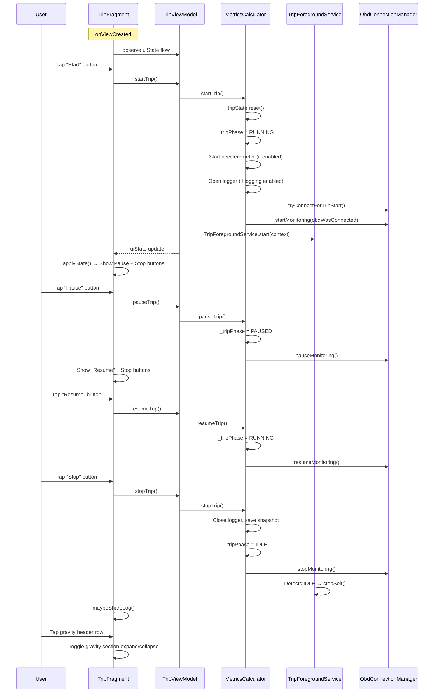
```mermaid
sequenceDiagram
    participant User
    participant TF as TripFragment
    participant VM as TripViewModel
    participant MC as MetricsCalculator
    participant FGS as TripForegroundService
    participant OCM as ObdConnectionManager

    Note over TF: onViewCreated
    TF->>VM: observe uiState flow

    User->>TF: Tap "Start" button
    TF->>VM: startTrip()
    VM->>MC: startTrip()
    MC->>MC: tripState.reset()
    MC->>MC: _tripPhase = RUNNING
    MC->>MC: Start accelerometer (if enabled)
    MC->>MC: Open logger (if logging enabled)
    MC->>OCM: tryConnectForTripStart()
    MC->>OCM: startMonitoring(obdWasConnected)
    VM->>FGS: TripForegroundService.start(context)

    VM-->>TF: uiState update
    TF->>TF: applyState() → Show Pause + Stop buttons

    User->>TF: Tap "Pause" button
    TF->>VM: pauseTrip()
    VM->>MC: pauseTrip()
    MC->>MC: _tripPhase = PAUSED
    MC->>OCM: pauseMonitoring()
    TF->>TF: Show "Resume" + Stop buttons

    User->>TF: Tap "Resume" button
    TF->>VM: resumeTrip()
    VM->>MC: resumeTrip()
    MC->>MC: _tripPhase = RUNNING
    MC->>OCM: resumeMonitoring()

    User->>TF: Tap "Stop" button
    TF->>VM: stopTrip()
    VM->>MC: stopTrip()
    MC->>MC: Close logger, save snapshot
    MC->>MC: _tripPhase = IDLE
    MC->>OCM: stopMonitoring()
    FGS->>FGS: Detects IDLE → stopSelf()
    TF->>TF: maybeShareLog()

    User->>TF: Tap gravity header row
    TF->>TF: Toggle gravity section expand/collapse
```

**Interactions:**
- **Start button** → Begin trip recording (changes to Resume when paused)
- **Pause button** → Pause trip (toggles to Resume)
- **Stop button** → End trip, save log, optionally share
- **Gravity header row** → Collapse/expand orientation section
- **Overflow menu (⋮)** → Navigate to other pages

**Button state machine:**

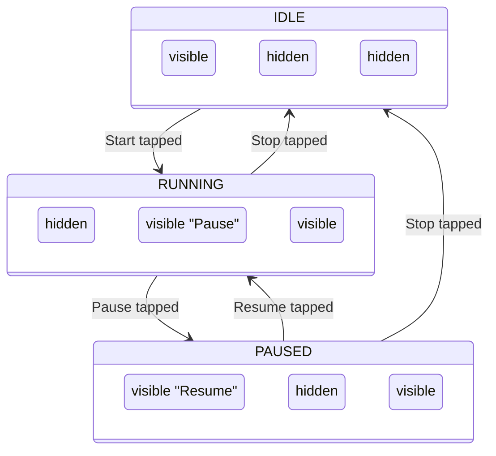
```mermaid
stateDiagram-v2
    state "IDLE" as idle {
        [Start] : visible
        [Pause] : hidden
        [Stop] : hidden
    }
    state "RUNNING" as running {
        [Start2] : hidden
        [Pause2] : visible "Pause"
        [Stop2] : visible
    }
    state "PAUSED" as paused {
        [Start3] : visible "Resume"
        [Pause3] : hidden
        [Stop3] : visible
    }

    idle --> running : Start tapped
    running --> paused : Pause tapped
    paused --> running : Resume tapped
    running --> idle : Stop tapped
    paused --> idle : Stop tapped
```

---

### Page 2: Dashboards (Nested Navigation)

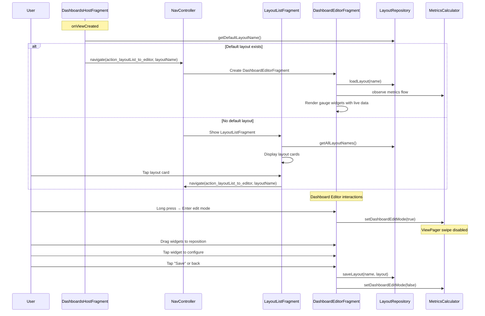
```mermaid
sequenceDiagram
    participant User
    participant DHF as DashboardsHostFragment
    participant Nav as NavController
    participant LLF as LayoutListFragment
    participant DEF as DashboardEditorFragment
    participant Repo as LayoutRepository
    participant MC as MetricsCalculator

    Note over DHF: onViewCreated
    DHF->>Repo: getDefaultLayoutName()

    alt Default layout exists
        DHF->>Nav: navigate(action_layoutList_to_editor, layoutName)
        Nav->>DEF: Create DashboardEditorFragment
        DEF->>Repo: loadLayout(name)
        DEF->>MC: observe metrics flow
        DEF->>DEF: Render gauge widgets with live data
    else No default layout
        Nav->>LLF: Show LayoutListFragment
        LLF->>Repo: getAllLayoutNames()
        LLF->>LLF: Display layout cards

        User->>LLF: Tap layout card
        LLF->>Nav: navigate(action_layoutList_to_editor, layoutName)
    end

    Note over DEF: Dashboard Editor interactions
    User->>DEF: Long press → Enter edit mode
    DEF->>MC: setDashboardEditMode(true)
    Note over MC: ViewPager swipe disabled

    User->>DEF: Drag widgets to reposition
    User->>DEF: Tap widget to configure
    User->>DEF: Tap "Save" or back
    DEF->>Repo: saveLayout(name, layout)
    DEF->>MC: setDashboardEditMode(false)
```

**This page uses a nested `NavHostFragment`** so the LayoutList → Editor back-stack is contained within the Dashboards page and doesn't interfere with the ViewPager.

**Interactions:**
- **Tap layout card** → Open dashboard in editor/viewer
- **Long press dashboard** → Enter edit mode (disables ViewPager swipe)
- **Drag widgets** → Reposition gauges
- **Tap widget** → Configure data source
- **Star icon** → Set as default dashboard

---

### Page 3: Details Screen

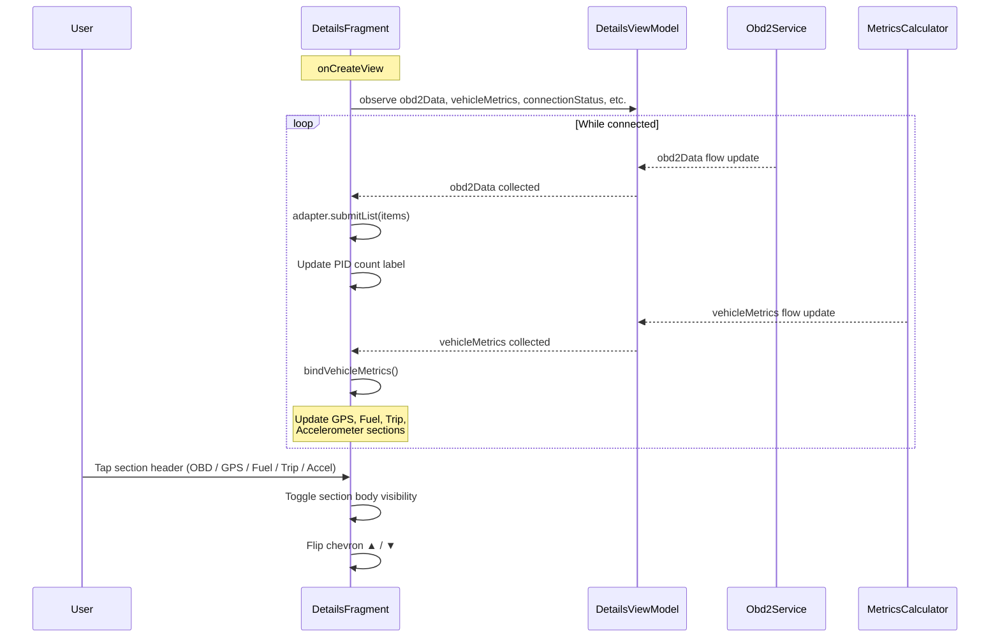
```mermaid
sequenceDiagram
    participant User
    participant DF as DetailsFragment
    participant VM as DetailsViewModel
    participant OBD as Obd2Service
    participant MC as MetricsCalculator

    Note over DF: onCreateView
    DF->>VM: observe obd2Data, vehicleMetrics, connectionStatus, etc.

    loop While connected
        OBD-->>VM: obd2Data flow update
        VM-->>DF: obd2Data collected
        DF->>DF: adapter.submitList(items)
        DF->>DF: Update PID count label

        MC-->>VM: vehicleMetrics flow update
        VM-->>DF: vehicleMetrics collected
        DF->>DF: bindVehicleMetrics()
        Note over DF: Update GPS, Fuel, Trip,<br/>Accelerometer sections
    end

    User->>DF: Tap section header (OBD / GPS / Fuel / Trip / Accel)
    DF->>DF: Toggle section body visibility
    DF->>DF: Flip chevron ▲ / ▼
```

**Interactions:**
- **Tap section header** → Collapse/expand section (OBD, GPS, Fuel, Trip, Accel)
- **Scroll** → Vertical scroll through PID table and metric sections
- **Swipe right** → Navigate to Dashboards
- **Swipe left** → Blocked (prevents accidental Trip Summary access)

**Data priority when disconnected:**
1. Last trip snapshot (if available)
2. Cached PIDs from last connection
3. Empty state

---

### Page 4: Trip Summary (Menu-only)

```mermaid
sequenceDiagram
    participant User
    participant TSF as TripSummaryFragment
    participant Storage as AppDataDirectory

    User->>TSF: Navigate via overflow menu
    TSF->>Storage: List trip log files
    TSF->>TSF: Display trip list (date, distance, duration)

    User->>TSF: Tap trip log entry
    TSF->>TSF: Show trip details (parsed from JSON)

    User->>TSF: Tap "View on Map"
    TSF->>TSF: navigateToPage(PAGE_MAP_VIEW)
```

**Access rules:**
- Not accessible during active trips (blocked with Toast)
- Not accessible via swipe (menu only)

---

### Page 5: Map View (Menu-only)

- Only accessible from Trip Summary page
- Displays trip GPS trace on a map
- Blocked from all other pages with Toast warning

---

### Page 6: Settings Screen (Menu-only)

```mermaid
sequenceDiagram
    participant User
    participant SF as SettingsFragment
    participant Settings as AppSettings
    participant Repo as VehicleProfileRepository
    participant OSM as ObdStateManager

    Note over SF: onViewCreated
    SF->>SF: setupProfileList()
    SF->>SF: setupConnectionToggles()
    SF->>SF: setupDataLogging()
    SF->>SF: setupExportImport()
    SF->>SF: loadCurrentSettings()

    User->>SF: Toggle "OBD Connection" switch
    SF->>SF: markAsChanged()

    User->>SF: Toggle "Auto-connect" switch
    SF->>SF: markAsChanged()

    User->>SF: Toggle "Log trip data" switch
    SF->>SF: markAsChanged()

    User->>SF: Tap Save button (top bar)
    SF->>Settings: updatePendingSettings()
    SF->>Settings: savePendingSettings()
    alt OBD mode changed
        SF->>SF: restartObdService()
        SF->>OSM: switchMode(newMode)
    end

    User->>SF: Tap "Add Profile" button
    SF->>SF: Show VehicleProfileEditSheet
    User->>SF: Fill profile details → Save
    SF->>Repo: save(profile)

    User->>SF: Tap profile row
    SF->>Repo: setActive(profile.id)
    SF->>SF: Toast "Profile set as active"

    User->>SF: Tap edit icon on profile
    SF->>SF: Show VehicleProfileEditSheet(profileId)

    User->>SF: Tap "Change Log Folder"
    SF->>SF: Launch SAF folder picker
    User->>SF: Select folder
    SF->>Settings: setLogFolderUri(uri)

    User->>SF: Tap "Export Data"
    SF->>SF: Launch folder picker → ExportImportManager.exportData()

    User->>SF: Tap "Import Data"
    SF->>SF: Launch folder picker → ExportImportManager.importData()
```

**Interactions:**
- **Save button** → Persist all pending setting changes
- **Toggle switches** → Mark settings as changed (pending save)
- **Add Profile** → Open BottomSheet editor
- **Tap profile row** → Set as active profile
- **Edit profile icon** → Open BottomSheet editor with existing data
- **Change Log Folder** → SAF folder picker
- **Export/Import Data** → Bulk data management
- **Debug section** (mock mode only) → Change discovery scenario

---

## Data Flow Architecture

### End-to-End Data Pipeline

```mermaid
flowchart TB
    subgraph Sources["Data Sources"]
        BT[BluetoothObd2Service<br/>polls ECU every ~200ms]
        GPS[GpsDataSource<br/>Android LocationManager]
        ACCEL[AccelerometerSource<br/>SensorManager]
    end

    subgraph Collection["Data Collection"]
        DO[DataOrchestrator<br/>combine + debounce 100ms]
    end

    subgraph Calculation["Calculation Engine"]
        MC[MetricsCalculator.calculate]
        FC[FuelCalculator]
        PC[PowerCalculator]
        TC[TripCalculator]
        AE[AccelEngine]
    end

    subgraph Output["Output"]
        SF[StateFlow&lt;VehicleMetrics&gt;]
        LOG[MetricsLogger → JSON file]
        FGS[TripForegroundService<br/>notification updates]
    end

    subgraph UI["UI Consumers"]
        TRIP[TripFragment]
        DASH[DashboardEditorFragment]
        DET[DetailsFragment]
    end

    BT -->|obd2Data flow| DO
    GPS -->|gpsData flow| DO
    DO --> MC
    ACCEL -->|drainBuffer()| MC
    MC --> FC
    MC --> PC
    MC --> TC
    MC --> AE
    FC --> MC
    PC --> MC
    TC --> MC
    AE --> MC
    MC --> SF
    MC --> LOG
    SF --> TRIP
    SF --> DASH
    SF --> DET
    SF --> FGS
```

### OBD2 Polling Tiers

```mermaid
flowchart LR
    subgraph Fast["Fast Tier (every cycle ~200ms)"]
        RPM[010C RPM]
        SPD[010D Speed]
        MAF[0110 MAF]
        THR[0111 Throttle]
        FUEL[015E Fuel Rate]
    end

    subgraph Slow["Slow Tier (every 5th cycle ~1s)"]
        TEMP[0105 Coolant Temp]
        FLVL[012F Fuel Level]
        VOLT[0142 Voltage]
        OTHER[All other<br/>supported PIDs]
    end

    subgraph Custom["Custom PIDs (slow tier cadence)"]
        CP[Mode 21/22/23<br/>from active profile]
    end
```

---

## Trip Lifecycle

### Complete Trip State Machine

```mermaid
stateDiagram-v2
    [*] --> IDLE

    IDLE --> RUNNING : startTrip()
    note right of IDLE
        - All counters reset
        - Logger closed
        - FGS stopped
        - Screen wake lock OFF
    end note

    RUNNING --> PAUSED : pauseTrip()
    note right of RUNNING
        - DataOrchestrator active
        - Trip accumulators updating
        - Logger writing samples
        - FGS showing notification
        - Screen wake lock ON
        - OBD reconnect monitoring ON
    end note

    PAUSED --> RUNNING : resumeTrip()
    note right of PAUSED
        - Pause time tracked
        - Accumulators frozen
        - Logger still open
        - FGS shows "Paused"
        - Screen wake lock OFF
        - OBD reconnect paused
    end note

    RUNNING --> IDLE : stopTrip()
    PAUSED --> IDLE : stopTrip()
```

### Trip Start Sequence (Full)

```mermaid
sequenceDiagram
    participant User
    participant TF as TripFragment
    participant VM as TripViewModel
    participant MC as MetricsCalculator
    participant TS as TripState
    participant AS as AccelerometerSource
    participant ML as MetricsLogger
    participant OCM as ObdConnectionManager
    participant FGS as TripForegroundService

    User->>TF: Tap "Start"
    TF->>VM: startTrip()
    VM->>MC: startTrip()

    MC->>TS: reset()
    MC->>MC: _tripPhase = RUNNING
    MC->>MC: Reset pause counters

    alt Accelerometer enabled
        MC->>AS: start()
        MC->>MC: waitingForGravityCapture = true
    end

    alt Logging enabled
        MC->>ML: open(context, profile, supportedPids)
        Note over ML: Creates timestamped JSON file
    end

    MC->>OCM: tryConnectForTripStart()
    alt OBD not connected + auto-connect ON
        OCM->>OCM: Get last device MAC
        OCM->>OCM: BluetoothAdapter.getRemoteDevice()
        OCM->>OCM: obdService.connect(device)
        OCM-->>MC: return true (connect initiated)
    else Already connected
        OCM-->>MC: return true
    else No auto-connect or no device
        OCM-->>MC: return false + Toast "GPS/Accel only"
    end

    MC->>OCM: startMonitoring(obdWasConnected)

    VM->>FGS: TripForegroundService.start(context)
    FGS->>FGS: startForeground(notification)
    FGS->>FGS: observeTripState()
```

---

## OBD Connection Management

### Auto-Reconnection During Trip

```mermaid
sequenceDiagram
    participant OCM as ObdConnectionManager
    participant OBD as BluetoothObd2Service
    participant BT as BluetoothAdapter

    Note over OCM: Trip is RUNNING, OBD was connected

    OBD-->>OCM: connectionState = DISCONNECTED
    OCM->>OCM: Toast "OBD disconnected - attempting reconnection..."
    OCM->>OCM: Start reconnection loop

    loop Reconnection Loop
        OCM->>OCM: attemptCount++

        alt attemptCount <= 5
            Note over OCM: Fast retry: 10s interval
        else attemptCount > 5
            Note over OCM: Slow retry: 60s interval
        end

        OCM->>BT: getRemoteDevice(lastMac)
        OCM->>OBD: connect(device)

        alt Connection succeeds
            OBD-->>OCM: connectionState = CONNECTED
            OCM->>OCM: Toast "OBD reconnected"
            OCM->>OCM: resetAttemptCounter()
            Note over OCM: Exit loop
        else Connection fails
            OBD-->>OCM: connectionState = ERROR
            OCM->>OCM: delay(retryInterval)
            Note over OCM: Continue loop
        end
    end
```

### Connection State Flow Across Components

```mermaid
flowchart TB
    BT[BluetoothObd2Service<br/>connectionState flow] --> OSM[ObdStateManager<br/>connectionState flow]
    BT --> OCM[ObdConnectionManager<br/>monitors during trips]
    BT --> FGS[TripForegroundService<br/>notification OBD status]

    OSM --> CF[ConnectFragment<br/>status label color]
    OSM --> DF[DetailsFragment<br/>indicator dot color]

    BT --> VM[ConnectViewModel<br/>isConnected LiveData]
    VM --> CF
```

### Bond Loss Handling

```mermaid
sequenceDiagram
    participant Android as Android OS
    participant Receiver as BluetoothBondLossReceiver
    participant OCM as ObdConnectionManager
    participant OBD as BluetoothObd2Service
    participant Settings as AppSettings

    Android->>Receiver: ACTION_BOND_STATE_CHANGED (BOND_NONE)
    Receiver->>OCM: onBondLost()
    OCM->>OCM: Cancel reconnection job
    OCM->>OBD: disconnect()
    OCM->>Settings: setLastDevice("", null)
    OCM->>OCM: stopMonitoring()
    OCM->>OCM: manualDisconnect = true
    Note over OCM: User must manually reconnect<br/>after re-pairing
```
