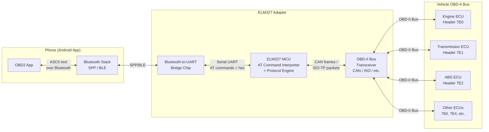
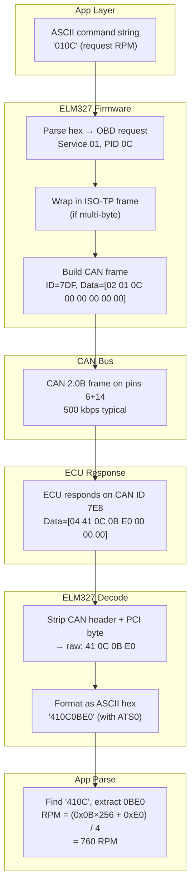
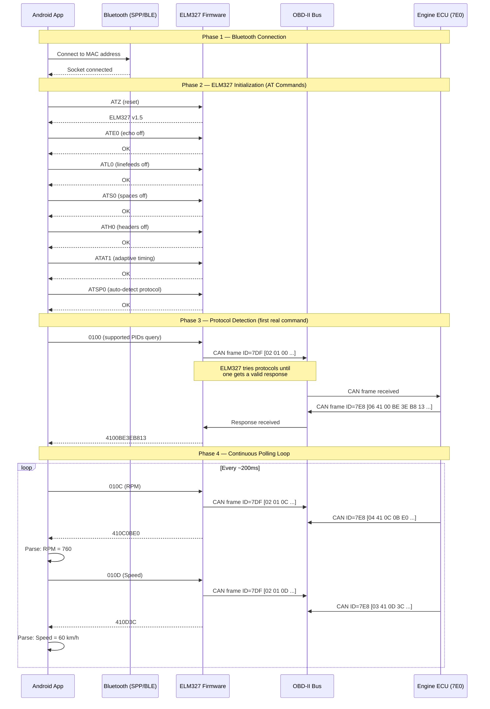
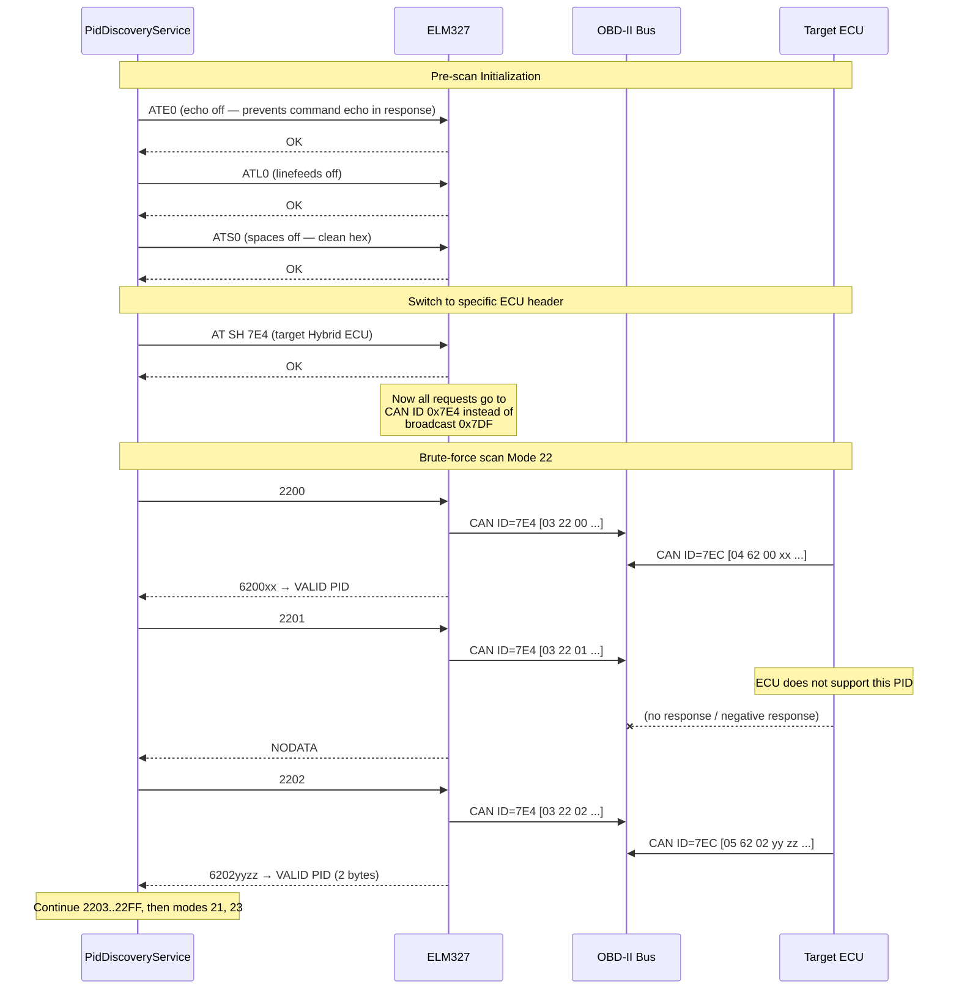
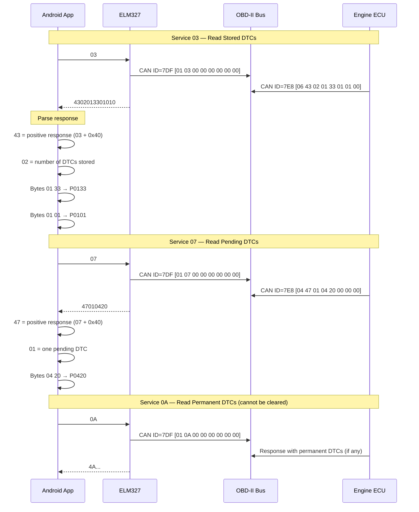
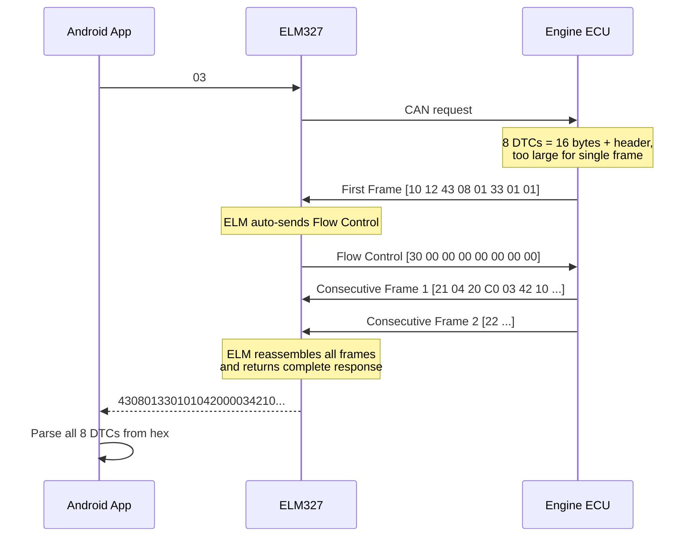
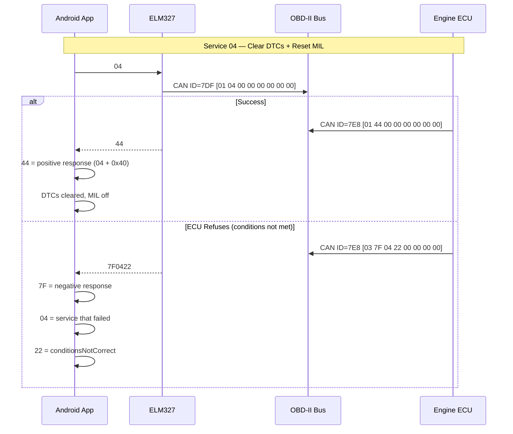
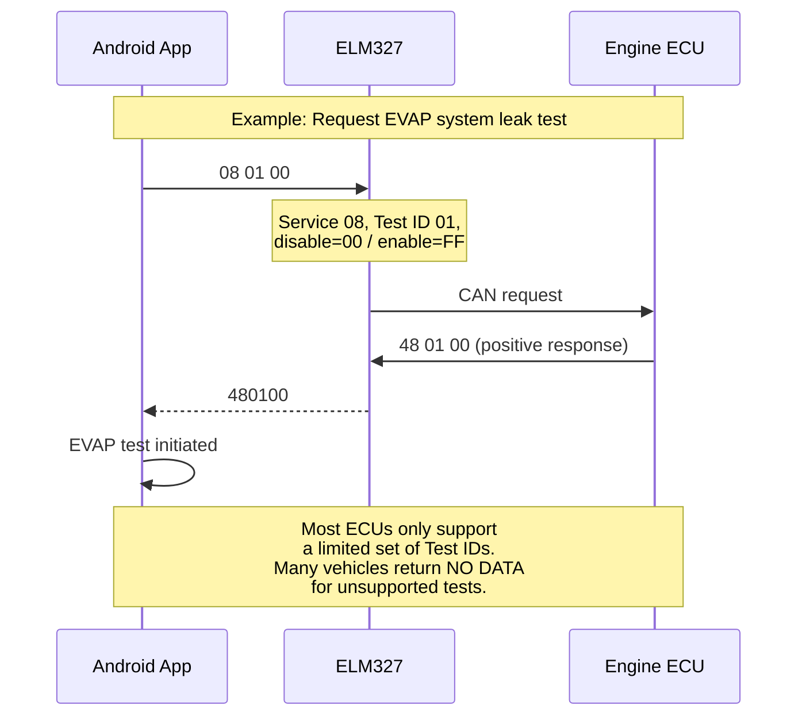
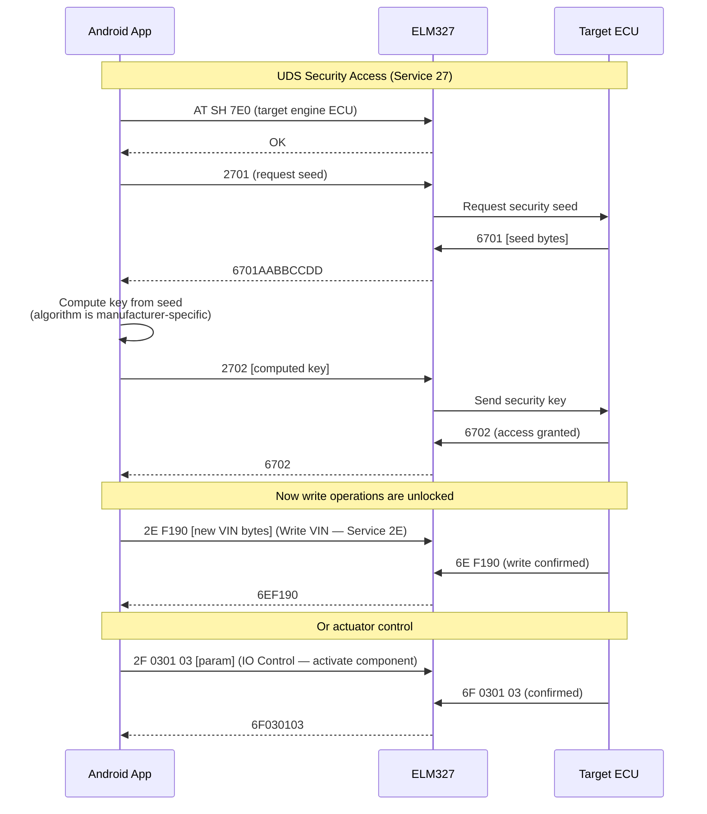

# ELM327 ↔ Vehicle ECU Architecture

## The Three Layers

The ELM327 is a **protocol translator** sitting between your phone (Bluetooth) and the vehicle's OBD-II bus. There are three distinct communication layers:

1. **Bluetooth Serial (Phone ↔ ELM327)** — plain ASCII text over a virtual serial port (SPP or BLE)
2. **AT Command Layer (Phone ↔ ELM327 firmware)** — configuration commands prefixed with `AT`
3. **OBD-II Protocol (ELM327 ↔ ECU)** — the ELM327 translates your ASCII hex commands into the correct electrical signaling on the vehicle bus

---

## Component Architecture



### Key points:
- **UART bridge chip** (e.g. HC-05, CC2541) handles Bluetooth ↔ serial conversion transparently
- **ELM327 MCU** parses AT commands, manages protocol timing, constructs/decodes bus frames
- **Transceiver** handles the physical-layer voltage levels for CAN, ISO 9141, KWP2000, etc.

---

## Protocol Stack



---

## Connection & Initialization Sequence

This is what happens when your app connects and starts polling:



---

## PID Discovery Sequence (Modes 21/22/23)

This is the flow the PID discovery feature uses with custom ECU headers:



---

## Reading Diagnostic Trouble Codes (DTCs)

OBD-II Service **03** retrieves stored DTCs, and Service **07** retrieves pending (not yet confirmed) DTCs. The ELM327 handles multi-frame responses automatically via ISO-TP.

### DTC Encoding

Each DTC is encoded as **2 bytes** (16 bits):

| Bits | Meaning | Values |
|------|---------|--------|
| 15–14 | System | `00`=Powertrain (P), `01`=Chassis (C), `10`=Body (B), `11`=Network (U) |
| 13–12 | Sub-type | `0`=SAE standard, `1`=Manufacturer specific |
| 11–8 | Category digit | `0`–`F` |
| 7–4 | Fault digit 2 | `0`–`F` |
| 3–0 | Fault digit 3 | `0`–`F` |

**Example:** bytes `01 33` → bits `0000 0001 0011 0011` → **P0133** (O2 Sensor Circuit Slow Response Bank 1 Sensor 1)

### DTC Read Sequence



### Multi-Frame DTC Response

When the ECU has many DTCs, the response exceeds 7 bytes and uses ISO-TP multi-frame:



---

## Clearing DTCs and Resetting MIL (Service 04)

Service **04** clears all stored DTCs and turns off the Malfunction Indicator Light (Check Engine Light). This is the primary **write operation** in standard OBD-II.

> **Warning:** Clearing DTCs also resets readiness monitors, emissions test data, and freeze frame data. The vehicle may fail an emissions test until all monitors complete their drive cycles again.



### What Service 04 Resets

| Item | Effect |
|------|--------|
| **Stored DTCs** | All cleared |
| **Pending DTCs** | All cleared |
| **Freeze Frame data** | Deleted |
| **MIL (Check Engine Light)** | Turned off |
| **Readiness monitors** | Reset to "not complete" |
| **O2 sensor test data** | Cleared |
| **On-board test results** | Cleared |
| **Distance since DTCs cleared** | Reset to 0 |

---

## All OBD-II Services (Modes) Reference

The ELM327 can send any of the 10 standard OBD-II service modes. Here's the complete list, categorized by read vs. write:

### Read-Only Services

| Service | Name | Description |
|---------|------|-------------|
| **01** | Current Data | Live sensor values (RPM, speed, temps, etc.) |
| **02** | Freeze Frame | Snapshot of sensor data when a DTC was set |
| **03** | Stored DTCs | Confirmed diagnostic trouble codes |
| **05** | O2 Sensor Monitoring | Oxygen sensor test results (non-CAN only) |
| **06** | On-Board Monitoring | Test results for continuously/non-continuously monitored systems |
| **07** | Pending DTCs | DTCs detected during current/last drive cycle (not yet confirmed) |
| **09** | Vehicle Info | VIN, calibration IDs, ECU name, etc. |
| **0A** | Permanent DTCs | DTCs that cannot be cleared by Service 04 |

### Write / Control Services

| Service | Name | Description | Risk Level |
|---------|------|-------------|------------|
| **04** | Clear DTCs | Clears all stored/pending DTCs, resets MIL and monitors | **Medium** — resets emissions readiness |
| **08** | Control On-Board Systems | Bi-directional control of vehicle components (e.g., EVAP leak test) | **High** — actuates physical components |

### Enhanced/Manufacturer Services (Used in PID Discovery)

| Service | Name | Description | Risk Level |
|---------|------|-------------|------------|
| **21** | Manufacturer-specific | Read extended data (common on Asian/European vehicles) | **Low** — read only |
| **22** | Extended Data by PID | Read manufacturer-specific PIDs (most common extended mode) | **Low** — read only |
| **23** | Read Memory by Address | Read ECU memory at specific addresses | **Low** — read only |
| **2E** | Write Data by ID | Write configuration values to ECU | **Critical** — modifies ECU config |
| **2F** | IO Control by ID | Actuator control (turn on fan, move throttle, etc.) | **Critical** — controls hardware |
| **31** | Routine Control | Start/stop/request results of ECU routines | **Critical** — executes routines |

---

## Service 08 — On-Board System Control

Service 08 is the only **standard** OBD-II write service beyond clearing DTCs. It allows bidirectional control for specific tests:



> **Note:** Service 08 support is rare and limited. Most scan tools don't expose it. The tests are defined per-manufacturer and can actuate physical components (solenoids, pumps), so this should be used with caution.

---

## UDS Write Operations (Enhanced — Not Standard OBD-II)

Beyond standard OBD-II, some ECUs support **Unified Diagnostic Services (UDS)** via the same CAN bus. The ELM327 can send these if you set the correct header, but they often require a **security access handshake** first:



### Why the App Only Uses Read Services

The OBD2 app's PID discovery intentionally scans only services **21, 22, 23** (read-only) and skips dangerous PID ranges because:

1. **Safety** — Write services (2E, 2F, 31) can permanently alter ECU configuration, damage components, or void warranties
2. **Security** — Most write operations require Service 27 security access, which needs manufacturer-specific seed/key algorithms
3. **Liability** — Actuator commands (2F) physically move components; incorrect use could cause engine damage, brake issues, etc.

---

## Negative Response Codes

When the ECU refuses a command, it returns a **negative response** (`7F`) with a reason code:

| Code | Name | Common Cause |
|------|------|-------------|
| `12` | Sub-function not supported | Mode not implemented on this ECU |
| `13` | Incorrect message length | Wrong number of data bytes sent |
| `14` | Response too long | Response exceeds transport capacity |
| `22` | Conditions not correct | Engine must be running, or vehicle must be stopped |
| `31` | Request out of range | PID not supported |
| `33` | Security access denied | Need Service 27 unlock first |
| `35` | Invalid key | Wrong security key supplied |
| `36` | Exceeded attempts | Too many wrong keys — ECU locked for a time period |
| `72` | General programming failure | Write/flash operation failed |
| `78` | Response pending | ECU is busy, will send real response later |

---

## How the CAN Frame Actually Looks

On the wire, a single OBD-II request/response looks like this:

| Layer | Request (App → ECU) | Response (ECU → App) |
|-------|-------------------|---------------------|
| **App sends** | `010C\r` | — |
| **ELM327 builds CAN frame** | ID=`7DF`, DLC=8, Data=`02 01 0C 00 00 00 00 00` | — |
| **ECU responds on CAN** | — | ID=`7E8`, DLC=8, Data=`04 41 0C 0B E0 00 00 00` |
| **ELM327 strips & formats** | — | `410C0BE0\r>` |
| **App parses** | — | Header=`410C`, bytes=`[0x0B, 0xE0]`, RPM=760 |

- **`02`** = PCI byte (2 data bytes follow in the ISO-TP frame)
- **`01 0C`** = OBD Service 01, PID 0C
- **`04`** = PCI byte (4 data bytes in response)
- **`41`** = Service 01 + 0x40 (positive response)
- **`0C`** = echo of the PID
- **`0B E0`** = actual data bytes

---

## Why ATE0/ATL0/ATS0 Matter for Discovery

The garbage responses like `DDTNODTA`, `ODTNOATA` are caused by echo + linefeeds being ON:

```
With echo ON (ATE1):     "2379\r" + "NO DATA\r>"  →  buffer reads "2379NODATA" → garbage hex
With echo OFF (ATE0):    "NO DATA\r>"              →  buffer reads "NODATA"     → clean parse
```

Similarly, `ATS0` ensures there are no spaces inside hex data, so `62 04 56` becomes `620456` — making substring parsing reliable without needing to strip whitespace mid-stream.

---

## Summary

- **ELM327 = ASCII-to-CAN translator.** Your app never touches the bus directly.
- **AT commands** configure the translator (echo, timing, protocol, target header).
- **Hex PID commands** (like `010C`, `2200`) are translated into CAN frames, sent on the bus, and the response is returned as ASCII hex over Bluetooth.
- **Headers** (`AT SH xxx`) control which ECU you're talking to — `7DF` is broadcast, `7E0` targets engine specifically.
- **Response byte** = request service byte + `0x40` (e.g., service `22` → response starts with `62`).
