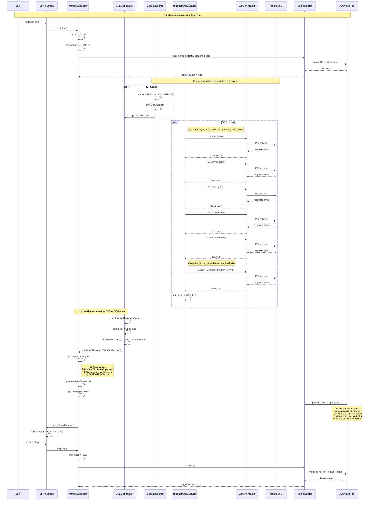

# Trip Logging Sequence Diagram

Shows how GPS and OBD samples are combined, calculated, and logged once a trip is started, with exact timing and data flow.

---

## Sequence Diagram



---

## Key Timing Details

| Event | Frequency | Notes |
|-------|-----------|-------|
| **GPS fixes** | ~1 Hz (min 500ms) | Emits `GpsDataItem` via `gpsData` flow |
| **Fast OBD tier** | ~200ms cycle | 5 PIDs (RPM, Speed, MAF, Throttle, Fuel Rate) |
| **Slow OBD tier** | ~1s (every 5 cycles) | All other PIDs (temps, fuel level, voltage, etc.) |
| **combine() trigger** | Whichever is faster (GPS or OBD) | Fires when either flow emits |
| **debounce(100ms)** | Batches rapid emissions | Prevents duplicate calculations when GPS+OBD emit close together |
| **Full calculation** | ~100–200ms effective | After debounce, one `VehicleMetrics` snapshot |
| **Logging** | Per calculation | Each snapshot becomes one JSON sample (if logging enabled) |

---

## What Gets Logged per Sample

```json
{
  "timestampMs": 1710529123456,
  "sampleNo": 42,
  "gps": { "lat": 28.6, "lon": 77.2, "speedKmh": 45, "altMsl": 215, ... },
  "obd": { "rpm": 1850, "speedKmh": 44, "mafGs": 12.3, "throttlePct": 18, "fuelRateLh": 2.1, ... },
  "fuel": { "fuelRateEffectiveLh": 2.1, "instantLper100km": 4.7, "tripFuelUsedL": 0.85, ... },
  "trip": { "distanceKm": 0.42, "timeSec": 38, "movingTimeSec": 35, ... },
  "accel": { ... } // if accelerometer enabled
}
```

- **GPS sub-object** only if any GPS data is present
- **OBD sub-object** only if any OBD data is present  
- **Derived sub-objects** (fuel, trip, accel) always present with computed values
- **Sample numbers** increment sequentially (1, 2, 3, ...)

---

## Edge Cases

- **No GPS fix**: `gps` sub-object omitted; OBD-only samples still logged
- **No OBD data (connection lost)**: `obd` sub-object omitted; GPS-only samples still logged
- **Trip paused**: `TripState.update()` skipped, but samples still logged with `tripPhase = PAUSED`
- **Logging disabled**: `logger.isOpen = false`; `logMetrics()` no-ops
